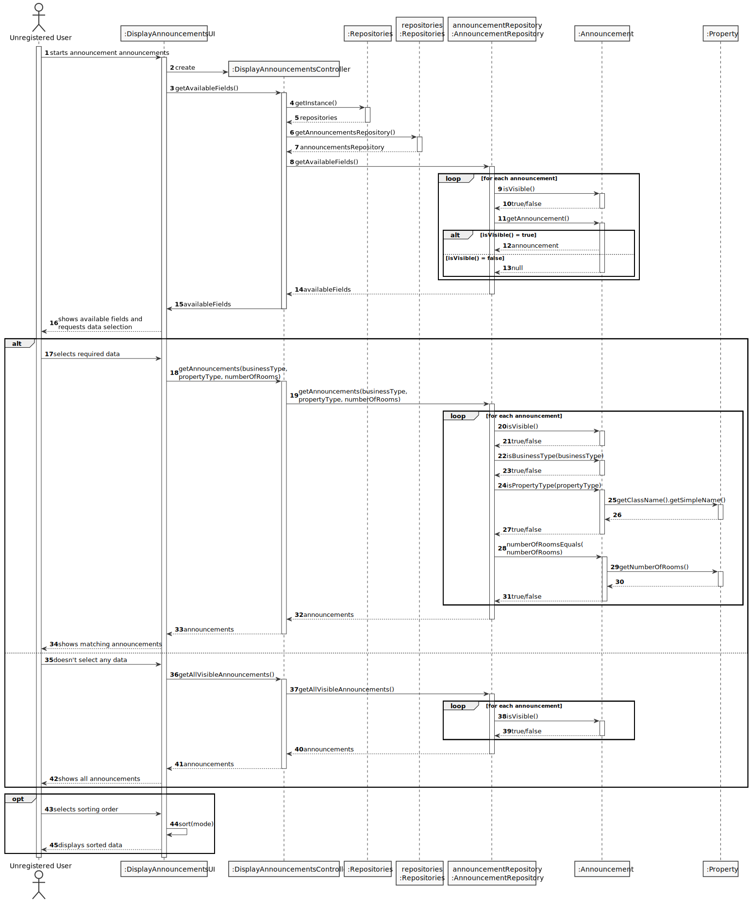

# US 001 - Display listed properties
## 3. Design - User Story Realization 

### 3.1. Rationale

| Interaction ID                                             | Question: Which class is responsible for...                                                   | Answer                         | Justification (with patterns)                                                                                  |
|:-----------------------------------------------------------|:----------------------------------------------------------------------------------------------|:-------------------------------|:---------------------------------------------------------------------------------------------------------------|
| Step 1: starts announcement announcements  		              | ... interacting with the actor?                                                               | DisplayAnnouncementsUI         | 	Pure Fabrication: there is no reason to assign this responsibility to any existing class in the Domain Model. |
|                                                            | ... coordinating the US?                                                                      | DisplayAnnouncementsController | Controller: intermediary between the UI and Domain layers                                                      |
|                                                            | ... ensuring that only one Announcement Repository exists?                                    | Repositories                   | Creator: aggregates AnnouncementRepository objects                                                             |
|                                                            | ... obtaining all available (selectable) fields?                                              | AnnouncementRepository         | Information Expert: knows all announcements                                                                    |
|                                                            | ... knowing if an announcement is visible?                                                    | Announcement                   | IE: knows its own information                                                                                  |
| Step 2: shows available fields and requests data selection | ... displaying the available fields?                                                          | DisplayAnnouncementsUI         | IE: responsible for user interaction                                                                           |
| Step 3: selects required data                              | ... validating user input?                                                                    | DisplayAnnouncementsUI         | IE: responsible for user interaction                                                                           |
| Step 4: shows matching announcements                       | ... obtaining matching announcements?                                                         | AnnouncementRepository         | IE: knows all announcements                                                                                    |
|                                                            | ... displaying announcements?                                                                 | DisplayAnnouncementsUI         | IE: responsible for user interaction                                                                           |
| Step 5: doesn't select any data                            | ... validating user input?                                                                    | DisplayAnnouncementsUI         | IE: responsible for user interaction                                                                           |
| Step 6: shows all announcements                            | ... obtaining all announcements?                                                              | AnnouncementRepository         | IE: knows all announcements                                                                                    |
|                                                            | ... checking if the requested type of business matches an announcement's type of business     | Announcement                   | IE: knows its own information                                                                                  |
|                                                            | ... checking if the requested type of property matches an announcement's type of property     | Property                       | IE: knows its own information                                                                                  |
|                                                            | ... checking if the requested number of bedrooms matches an announcement's number of bedrooms | Property                       | IE: knows its own information                                                                                  |
| Step 7: selects sorting order (price and/or location)      | ... handling user input?                                                                      | DisplayAnnouncementsUI         | IE: responsible for user interaction                                                                           |
| Step 8: sorts data as requested                            | ... displaying data?                                                                          | DisplayAnnouncementsUI         | IE: responsible for user interaction                                                                           |

### Systematization ##

According to the taken rationale, the conceptual classes promoted to software classes are: 

 * Announcement
 * Property
 * AnnouncementRepository
 * Repositories

Other software classes (i.e. Pure Fabrication) identified: 

 * DisplayAnnouncementUI  
 * DisplayAnnouncementController
 * AnnouncementLocationComparator
 * AnnouncementPriceComparator

## 3.2. Sequence Diagram (SD)

## 3.3. Class Diagram (CD)

