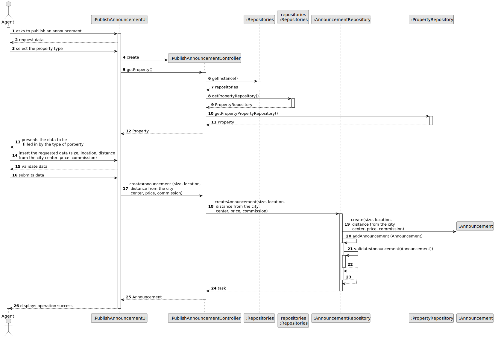

# US 002 - Publish Announcement

## 3. Design - User Story Realization 

### 3.1. Rationale

**SSD**

| Interaction ID                                                   | Question: Which class is responsible for...               | Answer                       | Justification (with patterns)                                                                                 |
|:-----------------------------------------------------------------|:----------------------------------------------------------|:-----------------------------|:--------------------------------------------------------------------------------------------------------------|
| Step 1 - asks to publish an announcement                         | 	... interacting with the actor?                          | PublishAnnouncementUI        | Pure Fabrication: there is no reason to assign this responsibility to any existing class in the Domain Model. |
| 			  		                                                          | 	... coordinating the US?                                 | PublishAnnoncementController | Controller                                                                                                    |
| 			  		                                                          | 	... instantiating a new Announcement?                    | Agent                        | Creator (Rule 1): in the DM, Agent publish an announcement.                                                   |
| 			  		                                                          | ... knowing the user using the system?                    | UserSession                  | IE: cf. A&A component documentation.                                                                          |
| Step 2 - request data	                                           | 		... displaying the UI for the actor to input data?					 | PublishAnnouncementUI        |                                                                                                               |
| Step 3 - select the property type		                              | 	...saving the selected property type??                   | Announcement                 | IE: object created in step 1 is categorizaded into a property type.                                           |
| Step 4 - presents the data fields to be in by the property type	 | 	...presents the fields according to property type?       | Property                     |                                                                                                               |
| Step 5 - insert the requested data                               | 	...saving the inputted data?                             | Announcement                 | IE: object created in step 1 has its own data.                                                                |
| Step 6 - validate data                                           | 	..					                                                  |                              |                                                                                                               |              
| Step 7 - submit data		                                           | 	...validating the data locally (mandatory data)?         | Announcement                 | IE: The object created has its own data.                                                                      | 
| 			  		                                                          | 	... validating all data (global validation)?             | AnnouncementRepository       | IE: knows all its announcements.                                                                              | 
| 			  		                                                          | 	... saving the created announcement?                     |AnnouncementRepository                    | IE: owns all its announcements.                                                                               | 
| Step 8  - displays operation sucess	                             | 	... informing operation success?                         | PublishAnnouncementUI        | Pure Fabrication.                                                                                             | 

### Systematization ##

According to the taken rationale, the conceptual classes promoted to software classes are: 

 * Announcement
 * Agent
 * Property

Other software classes (i.e. Pure Fabrication) identified: 
 * AnnouncementRepository
 * PublishAnnouncementUI  
 * PublishAnnouncementController

## 3.2. Sequence Diagram (SD)

### Alternative 1 - Full Diagram

This diagram shows the full sequence of interactions between the classes involved in the realization of this user story.

#
## 3.3. Class Diagram (CD)

