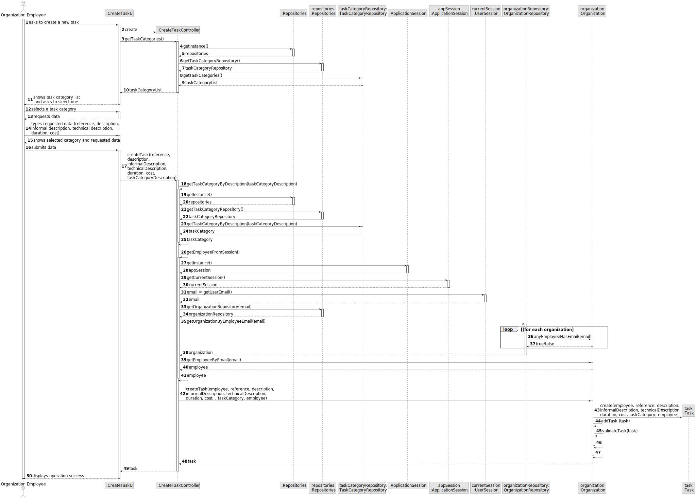

# US 002 - Publish Announcement

## 3. Design - User Story Realization 

### 3.1. Rationale

**SSD**

| Interaction ID | Question: Which class is responsible for...                | Answer                       | Justification (with patterns)                                                                                 |
|:---------------|:-----------------------------------------------------------|:-----------------------------|:--------------------------------------------------------------------------------------------------------------|
| Step 1 	       | 	... interacting with the actor?                           | PublishAnnouncementUI        | Pure Fabrication: there is no reason to assign this responsibility to any existing class in the Domain Model. |
| 			  		        | 	... coordinating the US?                                  | PublishAnnoncementController | Controller                                                                                                    |
| 			  		        | 	... instantiating a new Announcement?                     | Agent                        | Creator (Rule 1): in the DM, Agent publish an announcement.                                                   |
| 			  		        | ... knowing the user using the system?                     | UserSession                  | IE: cf. A&A component documentation.                                                                          |
| Step 2  		     | 		... displaying the UI for the actor to input data?					  | PublishAnnouncementUI        |                                                                                                               |
| Step 3  		     | 	...saving the selected property type??                    | Announcement                 | IE: object created in step 1 is categorizaded into a property type.                                           |
| Step 4  		     | 	...presents the fields according to property type?        | Property                     |                                                                                                               |
| Step 5  		     | 	...saving the inputted data?                              | Announcement                 | IE: object created in step 1 has its own data.                                                                |
| Step 6  		     | 	...verifying the data?						                              |                              |                                                                                                               |              
| Step 7  		     | 	...validating the data locally (mandatory data)?          | Announcement                 | IE: The object created has its own data.                                                                      | 
| 			  		        | 	... validating all data (global validation)?              | Agency                       | IE: knows all its announcements.                                                                              | 
| 			  		        | 	... saving the created announcement?                      | Agency                       | IE: owns all its announcements.                                                                               | 
| Step 8  		     | 	... informing operation success?                          | PublishAnnouncementUI        | Pure Fabrication.                                                                                             | 

### Systematization ##

According to the taken rationale, the conceptual classes promoted to software classes are: 

 * Agency
 * Announcement
 * Agent
 * Property

Other software classes (i.e. Pure Fabrication) identified: 

 * PublishAnnouncementUI  
 * PublishAnnouncementController

## 3.2. Sequence Diagram (SD)

### Alternative 1 - Full Diagram

This diagram shows the full sequence of interactions between the classes involved in the realization of this user story.

### Alternative 2 - Split Diagram

This diagram shows the same sequence of interactions between the classes involved in the realization of this user story, but it is split in partial diagrams to better illustrate the interactions between the classes.

It uses interaction ocurrence.

**Get Task Category List Partial SD**

**Get Task Category Object**

**Get Employee**

**Create Task**

## 3.3. Class Diagram (CD)

