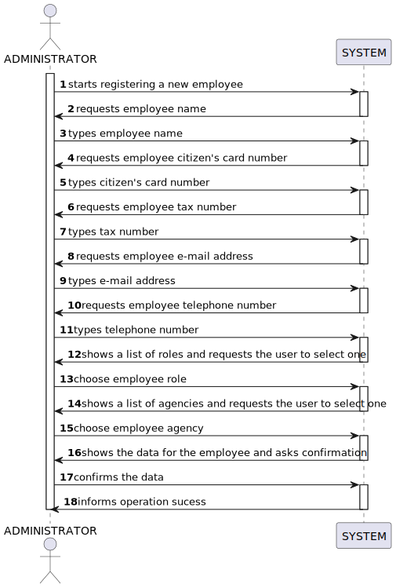

# US 003 - Register a new Employee

## 1. Requirements Engineering

### 1.1. User Story Description

As a system administrator, I want to register a new employee

### 1.2. Customer Specifications and Clarifications 

**From the specifications document:**

>	 The company's systems administrator will be responsable for registering all employees (specifying the name, the citizen's 
     card number, the tax number, the address, the e-mail address, the contact telephone number and the agency to which is assigned)

**From the client clarifications:**

> **Question:** "When registering a new employee, will the administrator set the respective employee password?"
>  
> **Answer:** "The password should have eight characters in length and should be generated automatically. The password 
              is sent to the employee by e-mail."
 
> **Question:** "You have stated before that name, cc number, tax number, email address, phone number and the assigned
                  agency of the employee are the mandatory requirements to register a new one, leaving out the 
                  employee's adress and role. This confused me, because it wasn't clear whether leaving out those 
                  two characteristics from the answer was intentional or not. Futhermore, the role of the employee 
                  seems like too much of an important piece of information to be left out. My request is, then, for 
                  you to state whether or not that was a conscious decision in your answer."
>
> **Answer:** "The role is required"

> **Question:** "When registering a new employee, all the required data (name, citizen's card number, etc...) 
                 have to be filled or exists not mandatory data?"
>
> **Answer:** "Required/Mandatory data that should be filled when registering an employee: name, the citizen's card number, 
               the tax number, the email address, the contact telephone number and the agency to which it is assigned"

> **Question:** "Does the system administrator select the agency to which the employee is assigned and his role from
                a list? Or does he just type that data?"
>
> **Answer:** "The System Administrator should select."
 
> **Question:** "According to the the statement, the administrator has to clarify the citizen's card number, but what 
>                 card is it? In the US, there is no identification card, so is it referring to the passport?"
>
> **Answer:** "You are correct. The citizen card number should be replaced by the passport card number"

>  **Question:**
>
> **Answer:**

### 1.3. Acceptance Criteria

* AC01: The name can't be empthy
* AC02: Telephone number must be a positive 9 digits number, and also an integer number
* AC03: E-mail address must have an "@"
* AC04: All requested data must be filled (name, telephone number, ...)

### 1.4. Found out Dependencies

* No dependency were found.

### 1.5 Input and Output Data

**Input Data:**

* Typed data:

	*  name 
	*  citizen's card number
	*  tax number
	*  address
	*  e-mail address
	*  contact telephone number
    *  role
	
* Selected data:

    * agency 

**Output Data:**

*  Employee data (name, cizen's card number, tax number, address,  e-mail address, contact telephone number and agency)
*  Agencies list
*  Request confirmation
*  Success of the operation
	

### 1.6. System Sequence Diagram (SSD)

### 1.7 Other Relevant Remarks

* N/A