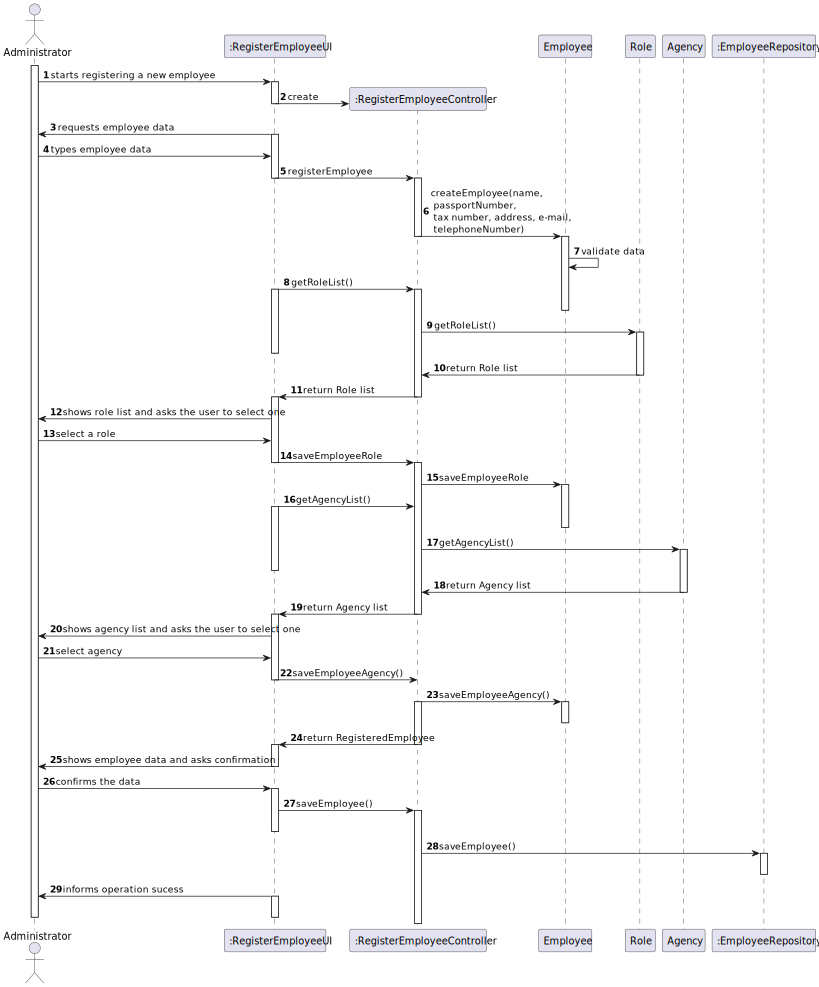

# US 003 - Register a new Employee 

## 3. Design - User Story Realization 

### 3.1. Rationale

| Interaction ID | Question: Which class is responsible for...   | Answer                     | Justification (with patterns)                                                                                 |
|:-------------  |:----------------------------------------------|:---------------------------|:--------------------------------------------------------------------------------------------------------------|
| Step 1  		 | 	... interacting with the actor?              | RegisterEmployeeUI         | Pure Fabrication: there is no reason to assign this responsibility to any existing class in the Domain Model. |
| 			  		 | 	... coordinating the US?                     | RegisterEmployeeController | Controller                                                                                                    |
| 			  		 | 	... instantiating a new Employee?            | Employee                   |                                                                                                               |
| 			  		 | ... knowing the user using the system?        | UserSession                | IE: cf. A&A component documentation.                                                                          |
| 			  		 | 							                                       | Organization               | IE: knows/has its own Employees                                                                               |
| 			  		 | 							                                       | Employee                   | IE: knows its own data (e.g. email)                                                                           |
| Step 2  		 | 							                                       |                            |                                                                                                               |
| Step 3  		 | 	...saving the inputted data?                 | Employee                   | IE: object created in step 1 has its own data.                                                                |
| Step 4  		 | 	...knowing the task categories to show?      | System                     | IE: Task Categories are defined by the Administrators.                                                        |
| Step 5  		 | 	... saving the selected category?            | Eployee                    | IE: object created in step 1 is classified in one Category.                                                   |
| Step 6  		 | 							                                       |                            |                                                                                                               |              
| Step 7  		 | 	... validating all data (local validation)?  | Task                       | IE: owns its data.                                                                                            | 
| 			  		 | 	... validating all data (global validation)? | Organization               | IE: knows all its tasks.                                                                                      | 
| 			  		 | 	... saving the created employee?             | Employee                   | IE: owns all its tasks.                                                                                       | 
| Step 8  		 | 	... informing operation success?             | RegisterEmployeeUI         | IE: is responsible for user interactions.                                                                     | 

### Systematization ##

According to the taken rationale, the conceptual classes promoted to software classes are: 

 * Employee

Other software classes (i.e. Pure Fabrication) identified: 

 * RegisterEmployeeUI  
 * RegisterEmployeeController  
 * RegisterEmployeeRepository

## 3.2. Sequence Diagram (SD)

### Alternative 1 - Full Diagram

This diagram shows the full sequence of interactions between the classes involved in the realization of this user story.

## 3.3. Class Diagram (CD)

