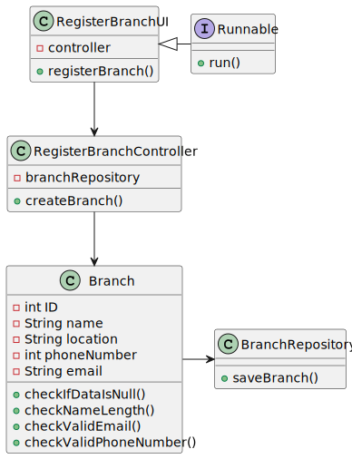

# US 003 - Register a new Employee

## 3. Design - User Story Realization

### 3.1. Rationale

| Interaction ID | Question: Which class is responsible for...  | Answer                     | Justification (with patterns)                                                                                 |
|:---------------|:---------------------------------------------|:---------------------------|:--------------------------------------------------------------------------------------------------------------|
| Step 1  		     | 	... interacting with the actor?             | RegisterBranchUI           | Pure Fabrication: there is no reason to assign this responsibility to any existing class in the Domain Model. |
| 			  		        | 	... coordinating the US?                    | RegisterBranchController   | Controller                                                                                                    |
| 			  		        | 	... instantiating a new Branch?             | Branch                     |                                                                                                               |
| 			  		        | ... knowing the user using the system?       | UserSession                | IE: cf. A&A component documentation.                                                                          |
| 			  		        | 							                                      | Branch                     | IE: knows its own data (e.g. branch ID)                                                                       |
| Step 2  		     | 	...saving the inputted data?                | Branch                   | IE: object created in step 1 has its own data.                                                                |
| Step 3  		     | 	... validating all data (local validation)? | Branch                   | IE: owns its data.                                                                                            |
| 		             | 	... saving the created branch?              | RegisterBranchRepository | IE: owns all its branches.                                                                                     | 
| Step 4  		     | 	... informing operation success?            | RegisterBranchUI         | IE: is responsible for user interactions.                                                                     | 

### Systematization ##

According to the taken rationale, the conceptual classes promoted to software classes are:

* Branch

Other software classes (i.e. Pure Fabrication) identified:

* RegisterBranchUI
* RegisterBranchController
* RegisterBranchRepository

## 3.2. Sequence Diagram (SD)

## 3.3. Class Diagram (CD)

