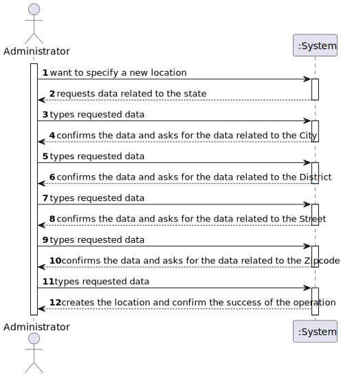

# US 006 - Specify states, Districts and Cities

## 1. Requirements Engineering

### 1.1. User Story Description

As a system administrator, I want to specify states, districts and cities in the system. 

### 1.2. Customer Specifications and Clarifications

**From the specifications document:**

> All registered information, except the agency commission, can be accessed by the client who intends to buy or rent the property; the client is, then, responsible for being able to consult the properties by type, number of rooms, and sort by criteria such as price or the city where the property is located.
  The client is responsible for being able to consult the properties by type, number of rooms, and sort by criteria such as price or the parish where the property is located.
  From the client clarifications:

**From the client clarifications:**

> **Question:** In user story 006, it says "As a system administrator, I want to specify districts, municipalities, and parishes in the system." What is the purpose of this function, how does the system administrator intend to use the ability to specify different locations?
>
> Answer:  The goal is to specify in the system information that can be used/selected to fill the location of the property. An example of the store location is: 71 ST. NICHOLAS DRIVE, NORTH POLE, FAIRBANKS NORTH STAR, AK, 99705.
           For instance, if the information about the existing US states is specified in the system, then the user only selects AK and does not need to write this information.
           
           This message is to clarify the format of the address "71 ST. NICHOLAS DRIVE, NORTH POLE, FAIRBANKS NORTH STAR, AK, 99705". In this address we have the:
           Street: 71 ST. NICHOLAS DRIVE;
           City: NORTH POLE;
           District: Fairbanks North Star (this is opcional);
           State: AK;
           Zipcode: 99705.

In the USA, the addresses will not include municipalities or parishes.

### 1.3. Acceptance Criteria
•	**AC1:** A location must not have any null variables.
>
•	**AC2:** A zipcode must be exactly 5 numbers.
>
•	**AC3:** A state must be exactly 2 capital letters.

### 1.4. Found out Dependencies
*	No further dependencies were found for this US.

### 1.5 Input and Output Data
**Input Data:**
* Typed data:
   Street
   City
   District
   State
   Zipcode
* Output Data:
  Sucess of the operation
    
### 1.6. System Sequence Diagram (SSD)

**Other alternatives might exist.**

### Alternative One

