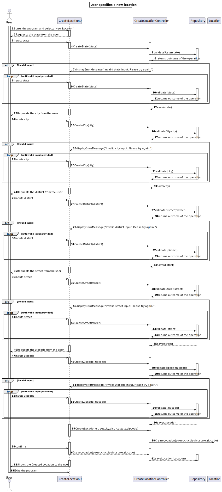
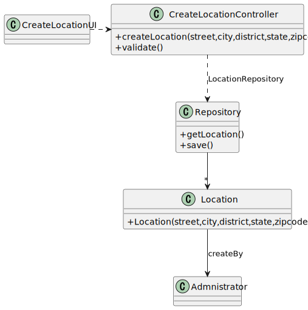

# US 006 - To create a Task 

## 3. Design - User Story Realization 

### 3.1. Rationale

**SSD - Alternative 1 is adopted.**

| Interaction ID | Question: Which class is responsible for... | Answer               | Justification (with patterns)                                                                                 |
|:-------------  |:--------------------- |:---------------------|:--------------------------------------------------------------------------------------------------------------|
| Step 1  		 |	... interacting with the actor? | UI         | IE: is responsible for user interactions. |
| 			  		 |	... coordinating the US? | Controller |  intermediary between the UI and Repository classes                                                                                                    |			                                                    
| 			  	                                                                        |
| Step 2  		 |							 |                      |                                                                                                               |
| Step 3  		 |	...saving the inputted data? | Repository                   |           |                                                                                                           |
| Step 6  		 |							 |                      |                                                                                                               |              
| Step 7  		 |	... validating all data (local validation)? | CreateLocationController                 |                                                                                          | 
| 			  		 |	... validating all data (global validation)? | CreateLocationController         | .                                                                                      | 
| 			  		 |	... saving the created Location? | CreateLocationController         |                                                                                       | 
| Step 8  		 |	... informing operation success?| CreateLocationUI         | IE: is responsible for user interactions.                                                                     | 

### Systematization ##

According to the taken rationale, the conceptual classes promoted to software classes are: 

 * Location

Other software classes (i.e. Pure Fabrication) identified: 

 * CreateLocationUI  
 * CreateLocationController

## 3.2. Sequence Diagram (SD)

### Alternative 1 - Full Diagram

This diagram shows the full sequence of interactions between the classes involved in the realization of this user story.

**Erorr checking SD**

## 3.3. Class Diagram (CD)

