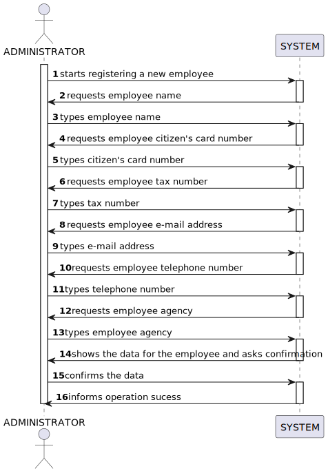

# US 003 - Register a new Employee

## 1. Requirements Engineering

### 1.1. User Story Description

As a system administrator, I want to register a new employee

### 1.2. Customer Specifications and Clarifications 

**From the specifications document:**

>	 The company's systems administrator will be responsable for registering all employees (specifying the name, the citizen's 
     card number, the tax number, the address, the e-mail address, the contact telephone number and the agency to which is assigned)

**From the client clarifications:**

> **Question:** As a system administrator, I want to register a new employee
>  
> **Answer:** The password should have eight characters in length and should be generated automatically. The password is sent to the employee by e-mail.

### 1.3. Acceptance Criteria

* N/A

### 1.4. Found out Dependencies

* No dependency were found.

### 1.5 Input and Output Data

**Input Data:**

* Typed data:
	*  name 
	*  citizen's card number
	*  tax number
	*  address
	*  e-mail address
	*  contact telephone number
	*  agency
	
* Selected data:

    * N/A 

**Output Data:**

*  Employee data (name, cizen's card number, tax number, address,  e-mail address, contact telephone number and agency)
*  Request confirmation
*  Success of the operation
	

### 1.6. System Sequence Diagram (SSD)

### 1.7 Other Relevant Remarks

* N/A