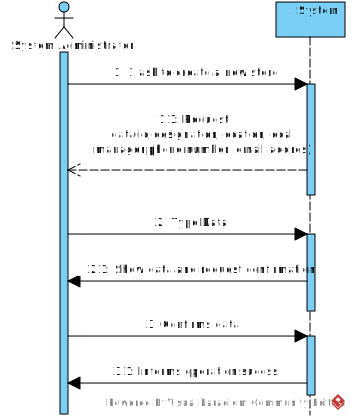

# US 005 - Register a store

## 1. Requirements Engineering

### 1.1. User Story Description

As a system administrator, I want to register a store.

### 1.2. Customer Specifications and Clarifications 

**From the specifications document:**

>	The company's systems administrator will be responsible for registering the  branches of the network (specifying
the designation, the location, the email address and the contact telephone number) 

**From the client clarifications:**

> 
>  
> 

### 1.3. Acceptance Criteria

* AC1: All required fiels must be filled in.
* AC2: ID must be an integer.

### 1.4. Found out Dependencies

* There is a dependency because user should be already authenticated.

### 1.5 Input and Output Data

**Input Data:**

* Typed data:
	* a ID 
	* a designation/name 
	* a location
    * a local manager
	* a phone number
	* a email address

**Output Data:**

* Store Card data
* (In)Success of the operation

### 1.6. System Sequence Diagram (SSD)

**Other alternatives might exist.**

