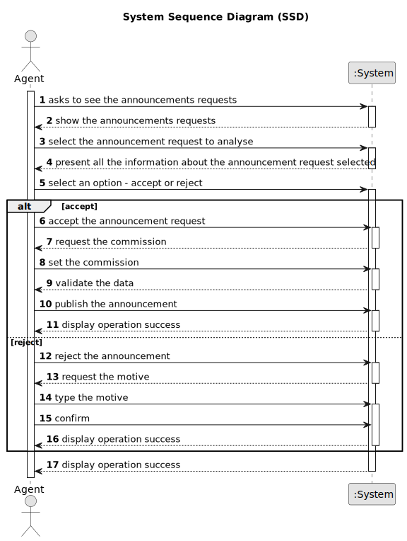

# US 008 - View announcement requests, review and approve/reject

## 1. Requirements Engineering

### 1.1. User Story Description

As an agent, I intend to see the list of property announcement requests made to myself, so that I can post the announcement.

### 1.2. Customer Specifications and Clarifications 

**From the specifications document:**

>	The real estate agent reviews advertisement requests, registers the information in the system and publishes the offer so that it is visible to all clients who visit the agency and use the application.

>	When the client decides to buy/rent the property, he sends a request for the purchase/lease of the property to the agent. After being appreciated by the agent, he accepts or rejects the order. If the request is accepted, the offer will not be shown again to clients using the application.

**From the client clarifications:**

> **Question:** Can the agent decline an announcement request?
> 
> **Answer:** Yes. The agent must include a message justifying the rejection.

> **Question:**: Can the agent select multiple requests at the same time?
> 
> **Answer:** No. The agent can only post one announcement at a time.

> **Question:** When displaying the property announcement requests in the system to the agent besides them being ordered from most recent to oldest is there a need to display the specific day when the requests were published?
> 
> **Answer:** The list of property announcement requests should be sorted by the date they were created, with the most recent requests appearing first. The system should show the date when the property announcement requests was made.

### 1.3. Acceptance Criteria

* **AC1:** The list of property announcement requests should be sorted by the date
they were created, with the most recent requests appearing first.
* **AC2:** An announcement is posted when a request is accepted. The list of requests
should be refreshed, and that request should not be shown again.

### 1.4. Found out Dependencies

* 

### 1.5 Input and Output Data

**Input Data:**

* Typed data:
  * Commission  
  * Motive to reject the announcement request
	
	
* Selected data:
  * Accept announcement request
  * Reject announcement request
	

**Output Data:**

* List of announcements requests made to myself
* Information about the announcement request selected

### 1.6. System Sequence Diagram (SSD)

**Other alternatives might exist.**

#### Alternative One

### 1.7 Other Relevant Remarks

* TOCHANGE-The created task stays in a "not published" state in order to distinguish from "published" tasks.