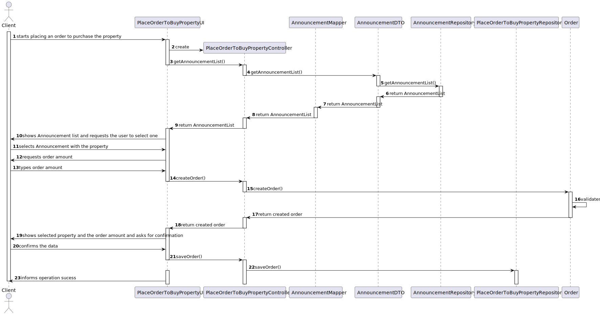
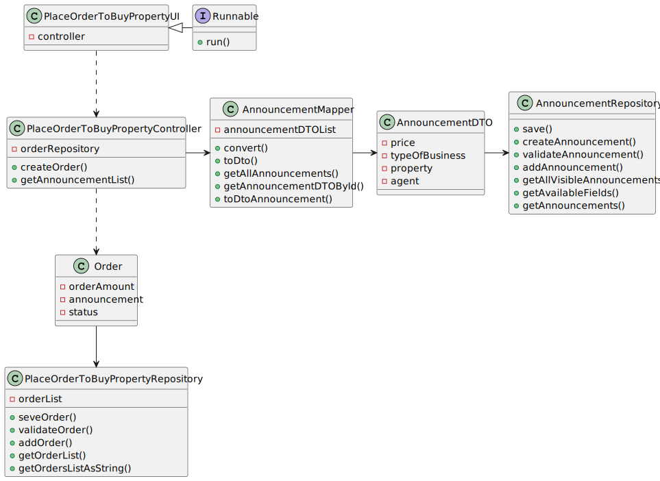

# US 010 - As a client, I place an order to purchase the property, submitting the order amount

## 3. Design - User Story Realization 

### 3.1. Rationale

| Interaction ID | Question: Which class is responsible for...   | Answer                            | Justification (with patterns)                                                                                 |
|:-------------  |:----------------------------------------------|:----------------------------------|:--------------------------------------------------------------------------------------------------------------|
| Step 1  		 | 	... interacting with the actor?              | PlaceOrderToBuyPropertyUI         | Pure Fabrication: there is no reason to assign this responsibility to any existing class in the Domain Model. |
| 			  		 | 	... coordinating the US?                     | PlaceOrderToBuyPropertyController | Controller                                                                                                    |
| 			  		 | 	... instantiating a new Order?               | Order                             | Creator                                                                                                       |
| 			  		 | ... knowing the user using the system?        | UserSession                       | IE: cf. A&A component documentation.                                                                          |
| Step 2  		 | 							                                       |                                   |                                                                                                               |
| Step 3  		 | 	...saving the inputted data?                 | Order                             | IE: object created in step 1 has its own data.                                                                | 
| Step 5  		 | 	... saving the selected order?               | Order                             |                                                   |
| Step 6  		 | 							                                       |                                   |                                                                                                               |              
| Step 7  		 | 	... validating all data (local validation)?  | Task                              | IE: owns its data.                                                                                            | 
| 			                                                                                | 
| 			  		 | 	... saving the created order?                | PlaceOrderToBuyPropertyRepository                      | IE: owns all its tasks.                                                                                       | 
| Step 8  		 | 	... informing operation success?             | PlaceOrderToBuyPropertyUI         | IE: is responsible for user interactions.                                                                     | 

### Systematization ##

According to the taken rationale, the conceptual classes promoted to software classes are: 

 * Order

Other software classes (i.e. Pure Fabrication) identified: 

 *  PlaceOrderToBuyPropertyUI 
 *  PlaceOrderToBuyPropertyController
 *  PlaceOrderToBuyPropertyRepository
 *  AnnouncementDTO

## 3.2. Sequence Diagram (SD)

### Alternative 1 - Full Diagram

This diagram shows the full sequence of interactions between the classes involved in the realization of this user story.

## 3.3. Class Diagram (CD)

