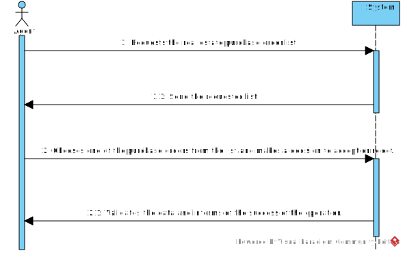

# US 011 - List the real estate purchase orders to accept or reject the order
## 1. Requirements Engineering

### 1.1. User Story Description

As an agent, I want to list property purchase requests to accept or reject a property purchase order. After accepting or rejecting, an email notification should be sent to the client.

### 1.2. Customer Specifications and Clarifications 

**From the specifications document:**

 ***The Agent is responsible for accepting or rejecting requests to purchase a property.***

When a request:

      > Is accepted - the system must automatically reject all other orders for the same property.

      > Has no offers - the system should display an empty list of offers.

 ***The system is responsible for: ***
     
      > Allowing real estate agents to view a list of purchase orders for properties.

       > Sorting the properties from oldest to newest.

       > For each property, the system should sort the list of purchase orders by the amount offered, with the highest offer appearing first.

**From the client clarifications:**

> **Question:** Assuming the previous anwser is the potential buyer, should the owner be informed about the sale success?
>  
> **Answer:** The owner will be contacted by means of a phone call. This is not a feature of the system.

> **Question:** Can the Agent update more than one real estate purchase application at the same time?
>  
> **Answer:** The Agent can respond to more than one purchase request, but not at the same time.

> **Question:** Can the Agent after making the decision to accept or reject the purchase request go back on his decision?
>  
> **Answer:** After confirming his decision, the Agent cannot go back.

> **Question:** Does grouping purchase orders by property mean that only properties are displayed, and only aftera property is selected are its requests shown? Or are all the requests shown but requests of the same property are shown together?
>  
> **Answer:** The system should show (to the agent) a list of properties that have prurchase orders. For each property the system should show a list of purchase orders. Typically we have a small number of purchase orders and we want all orders shown (by property) without selecting a property in particular.

> **Question:** When properties are sorted form oldest to most recent, does this relate to when the property was added to the system or the property's date of construction?
>  
> **Answer:** This sorting should be made using the date when the property announcement was published by the agent.

### 1.3. Acceptance Criteria

* **AC1:** The list of purchase orders should be grouped by property. The properties should be sorted from the oldest to the most recent one. For each property, the list of purchase orders should be sorted by the amount offered, the highest offer must appear first. 
* **AC2:** For each offer, the agent must be able to accept or decline it. The action of accepting or declining an offer should trigger an email notification to the client.
* **AC3:** When a purchase order is accepted, all the other orders should be declined, and a message sent to the client.
* **AC4:** If a property does not contain any offers, the system should show an empty list of offers.

### 1.4. Found out Dependencies

* There has to be real estate to be sold.
* In order for the Agent to accept or reject there have to be purchase requests for the properties.

### 1.5 Input and Output Data

**Input Data:**

* Typed data:
	* An acceptance or rejection answer 
	
* Selected data:
	* role
	* property list

**Output Data:**

* An email to the customer with information about the agent's decision.
* (In)Success of the operation

### 1.6. System Sequence Diagram (SSD)

### 1.7 Other Relevant Remarks

* N/A