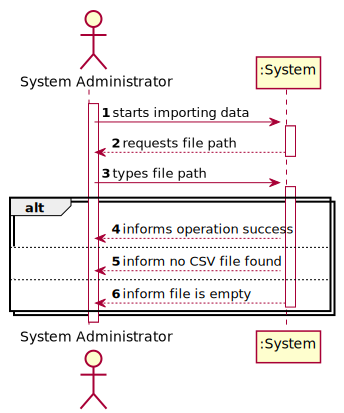

# US 012 - Import data from a legacy system

## 1. Requirements Engineering

### 1.1. User Story Description

As a system administrator, I want to import information from a legacy system that has been in use in several agencies.

### 1.2. Customer Specifications and Clarifications 

**From the specifications document:**

>	Real Estate USA needs an application that enables buyers who visit its stores/agencies to access the properties available for lease or sale, as well as the company’s employees to carry out a set of operations related to the real estate business. Among these operations are the publication of rental and sale advertisements, the registration of a business (lease or sale) and the scheduling and registration of visits to the property.

>	 The application to be developed in this project will replace an application that was already in operation in some agencies and will be replaced in July 2023.

**From the client clarifications:**

> **Question:** Can the System Administrator, when wanting to import information from a legacy system, send more than one file at once?
>
> **Answer:** Only one file at a time.

> **Question:** In the CSV containing the data from the legacy system, properties classified as Apartment have themselves a value for Sun Exposure. However, the specification document describes this attribute as exclusive to the property type House: "In case the property is a house, the existence of a basement, an inhabitable loft, and sun exposure must be registered as well.". Do we add Sun Exposure to the apartment's attributes or does it stay exclusive to house?
>
> **Answer:** When loading an apartment from the legacy system (from the CSV file) you should ignore the attribute Sun Exposure.
The CSV file contains data exported from a legacy system. The legacy system does not registers the same information that the system that you are developing now registers. For instance, the legacy system does not associates an agent to a property, therefore, when importing data from a legacy system you should create a agent/employee having:
name=Legacy Agent; passport card number=000000000; tax number=000000000, email address=legacy@realstateUSA.com; contact telephone number = 0000000000; and associate this "legacy agent" with each property (make it the property responsable agent). Moreover, you should prepare your system to accept two formats for the passport number, one with 9 numbers and the other starts with the letter C followed by eight numbers.

> **Question:** It has been clearly previously established that there are two types of commissions (fixed and percentage). However, the CSV containing the data from the legacy system only has one column that references any type of commission: column U "commission(%)". Does that mean that there is only one type of commission, or was the fixed type accidentally left out or did I fail to notice the fixed commission type?
>
> **Answer:** In the past our company only had the type of commissions that you see in the CSV file. Our legacy system has many limitations and this is why we are asking you to develop a new system.

### 1.3. Acceptance Criteria

* **AC1:** The system administrator must be able to choose a file to import.
* **AC2:** The system should only accept CSV files.
* **AC3:** The file content must be validated, showing a message to the system administrator if the file is empty or its content is not in the requested format.
* **AC4:** The import operation, when successful, should trigger a success message to the system administrator.

### 1.4. Found out Dependencies

* There is a dependency to "US003 Create a task category" since at least a task category must exist to classify the task being created.

### 1.5 Input and Output Data

**Input Data:**

* Typed data:
	* file path

**Output Data:**

[//]: # (* List of added entries)
* (In)Success of the operation

### 1.6. System Sequence Diagram (SSD)

**Other alternatives might exist.**

#### Alternative One

#### Alternative Two

### 1.7 Other Relevant Remarks

* The created task stays in a "not published" state in order to distinguish from "published" tasks.