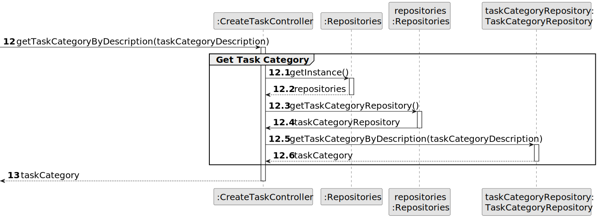
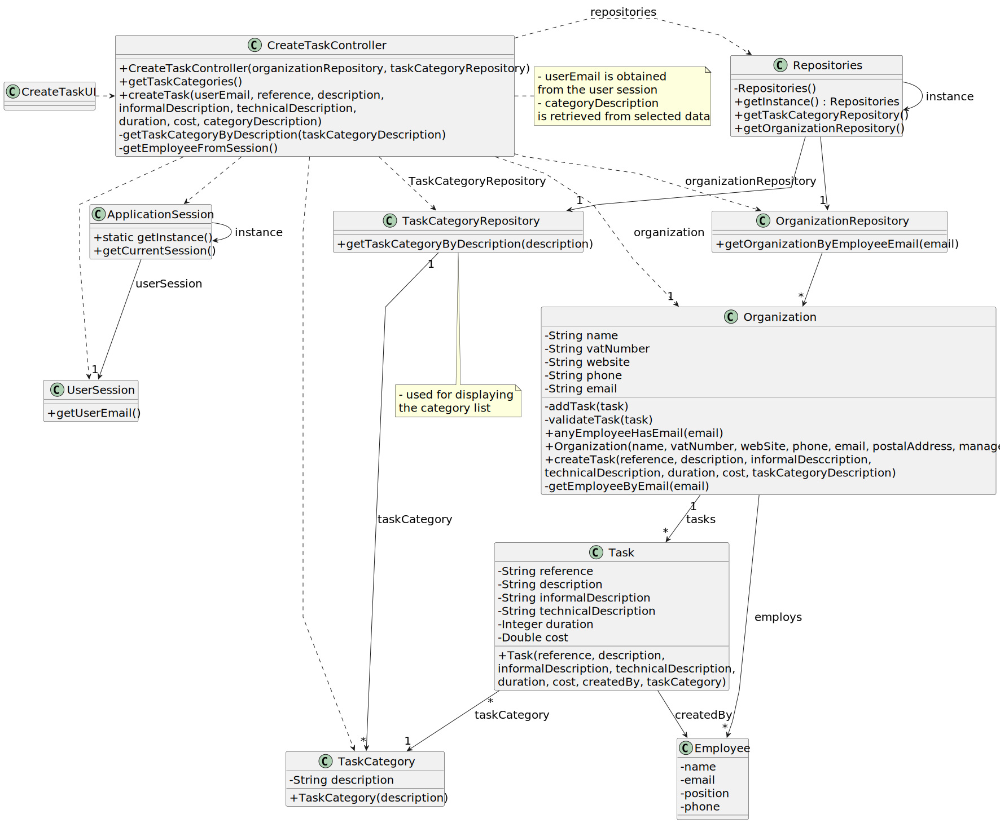

# US 012 - Import data from a legacy system

## 3. Design - User Story Realization 

### 3.1. Rationale

**SSD - Alternative 1 is adopted.**

| Interaction ID | Question: Which class is responsible for...              | Answer                 | Justification (with patterns)                                                                                  |
|:---------------|:---------------------------------------------------------|:-----------------------|:---------------------------------------------------------------------------------------------------------------|
|                | ... interacting with the actor?                          | LegacyImportUI         | 	Pure Fabrication: there is no reason to assign this responsibility to any existing class in the Domain Model. |
|                | ... coordinating the US?	                                | LegacyImportController | Controller: decouple the UI layer from the Domain Layer                                                        |
|                | ... reading a file from disk?                            | FileOps                | Information Expert: responsible for file operations                                                            |
|                | ... verifying a file's extension is ".csv"?              | FileOps                | Information Expert: responsible for file operations                                                            |
|                | ... verifying a file isn't empty?                        | FileOps                | Information Expert: responsible for file operations                                                            |
|                | ... getting data from a CSV file?                        | CsvHandler             | Information Expert: responsible for CSV manipulation                                                           |
|                | ... getting announcement data from a CSV file?           | CsvHandler             | Information Expert: responsible for CSV manipulation                                                           |
|                | ... knowing if a given Employee exists in the system?    | EmployeeRepository     | Information Expert: knows all Employees                                                                        |
|                | ... knowing an Employee's name?                          | Employee               | Information Expert: knows its own information                                                                  |
|                | ... instantiating a new Employee?                        | EmployeeRepository     | Creator (rule 1): aggregates Employee instances                                                                |
|                | ... validating an Employee?                              | Employee               | Information Expert: knows its own information                                                                  |
|                | ... ensuring the created Employee has no duplicates?     | EmployeeRepository     | Information Expert: knows all Employees                                                                        |
|                | ... saving the created Employee?                         | EmployeeRepository     | Information Expert: aggregates Employee instances                                                              |
|                |                                                          |                        |                                                                                                                |
|                | ... knowing if a given Client exists in the system?      | ClientRepository       | Information Expert: knows all Clients                                                                          |
|                | ... knowing an Client's name?                            | Client                 | Information Expert: knows its own information                                                                  |
|                | ... instantiating a new Client?                          | ClientRepository       | Creator (rule 1): aggregates Client instances                                                                  |
|                | ... validating a Client?                                 | Client                 | Information Expert: knows its own information                                                                  |
|                | ... ensuring the created Client has no duplicates?       | ClientRepository       | Information Expert: knows all Clients                                                                          |
|                | ... saving the created Client?                           | ClientRepository       | Information Expert: aggregates Client instances                                                                |
|                |                                                          |                        |                                                                                                                |
|                | ... instantiating a new Announcement?                    | AnnouncementRepository | Creator (rule 1): aggregates Announcement instances                                                            |
|                | ... instantiating a new Property?                        | Announcement           | Creator (rule 1): contains Property instances                                                                  |
|                | ... validating a Property?                               | Property               | Information Expert: knows its own information                                                                  |
|                | ... ensuring the created Property's location is unique?  | Announcement           | Creator (rule 2): records Property instances                                                                   |
|                | ... validating an Announcement?                          | Announcement           | Information Expert: knows its own information                                                                  |
|                | ... ensuring the created Announcement has no duplicates? | AnnouncementRepository | Information Expert: knows all Announcements                                                                    |
|                |                                                          |                        |                                                                                                                |
|                |                                                          |                        |                                                                                                                |

| Interaction ID | Question: Which class is responsible for... | Answer               | Justification (with patterns)                                                                                 |
|:-------------  |:--------------------- |:---------------------|:--------------------------------------------------------------------------------------------------------------|
| Step 1  		 |	... interacting with the actor? | CreateTaskUI         | Pure Fabrication: there is no reason to assign this responsibility to any existing class in the Domain Model. |
| 			  		 |	... coordinating the US? | CreateTaskController | Controller                                                                                                    |
| 			  		 |	... instantiating a new Task? | Organization         | Creator (Rule 1): in the DM Organization has a Task.                                                          |
| 			  		 | ... knowing the user using the system?  | UserSession          | IE: cf. A&A component documentation.                                                                          |
| 			  		 |							 | Organization         | IE: knows/has its own Employees                                                                               |
| 			  		 |							 | Employee             | IE: knows its own data (e.g. email)                                                                           |
| Step 2  		 |							 |                      |                                                                                                               |
| Step 3  		 |	...saving the inputted data? | Task                 | IE: object created in step 1 has its own data.                                                                |
| Step 4  		 |	...knowing the task categories to show? | System               | IE: Task Categories are defined by the Administrators.                                                        |
| Step 5  		 |	... saving the selected category? | Task                 | IE: object created in step 1 is classified in one Category.                                                   |
| Step 6  		 |							 |                      |                                                                                                               |              
| Step 7  		 |	... validating all data (local validation)? | Task                 | IE: owns its data.                                                                                            | 
| 			  		 |	... validating all data (global validation)? | Organization         | IE: knows all its tasks.                                                                                      | 
| 			  		 |	... saving the created task? | Organization         | IE: owns all its tasks.                                                                                       | 
| Step 8  		 |	... informing operation success?| CreateTaskUI         | IE: is responsible for user interactions.                                                                     | 

### Systematization ##

According to the taken rationale, the conceptual classes promoted to software classes are: 

 * Organization
 * Task

Other software classes (i.e. Pure Fabrication) identified: 

 * CreateTaskUI  
 * CreateTaskController

## 3.2. Sequence Diagram (SD)

### Alternative 1 - Full Diagram

This diagram shows the full sequence of interactions between the classes involved in the realization of this user story.

### Alternative 2 - Split Diagram

This diagram shows the same sequence of interactions between the classes involved in the realization of this user story, but it is split in partial diagrams to better illustrate the interactions between the classes.

It uses interaction ocurrence.

**Get Task Category List Partial SD**

**Get Task Category Object**

**Get Employee**

**Create Task**

## 3.3. Class Diagram (CD)

