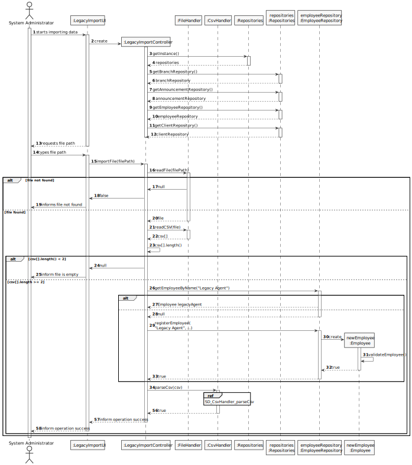
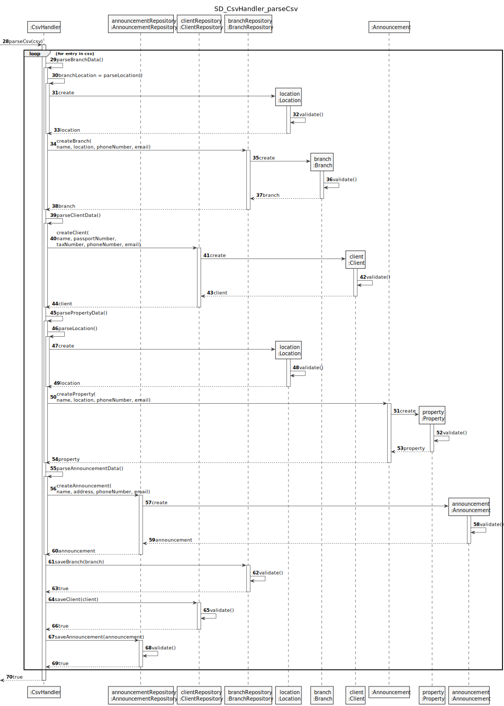
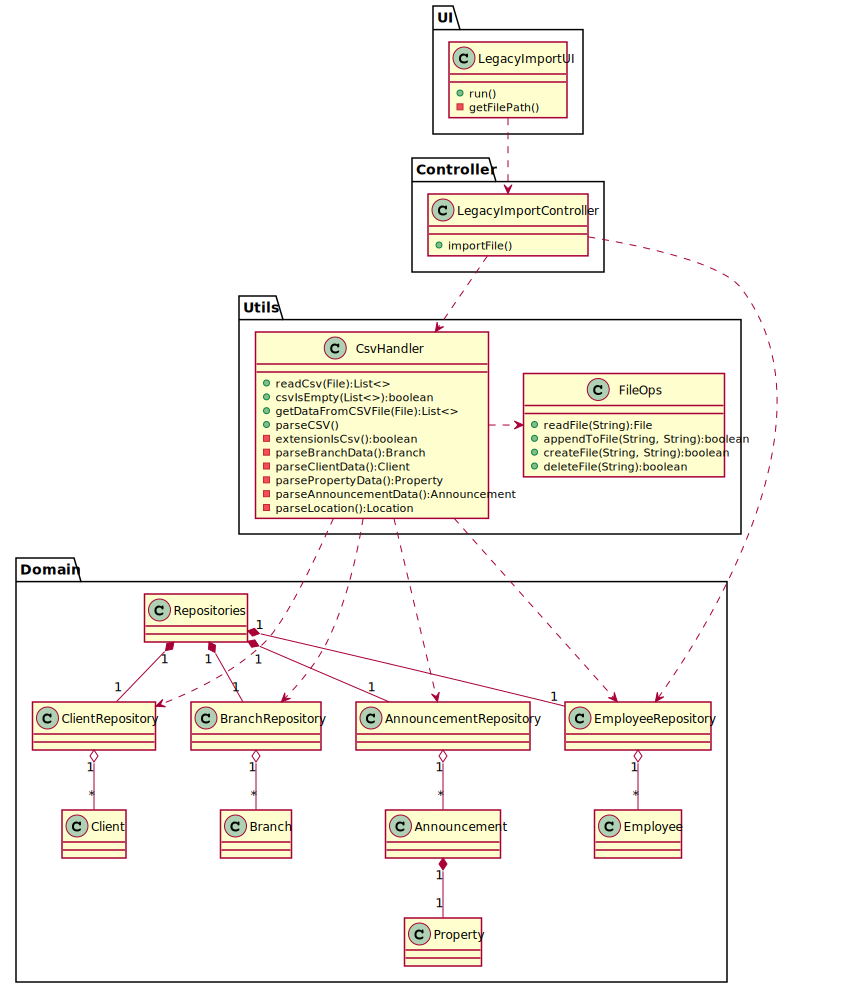

# US 012 - Import data from a legacy system

## 3. Design - User Story Realization 

### 3.1. Rationale

**SSD - Alternative 1 is adopted.**

| Interaction ID | Question: Which class is responsible for...              | Answer                 | Justification (with patterns)                                                                                  |
|:---------------|:---------------------------------------------------------|:-----------------------|:---------------------------------------------------------------------------------------------------------------|
|                | ... interacting with the actor?                          | LegacyImportUI         | 	Pure Fabrication: there is no reason to assign this responsibility to any existing class in the Domain Model. |
|                | ... coordinating the US?	                                | LegacyImportController | Controller: decouple the UI layer from the Domain Layer                                                        |
|                | ... reading a file from disk?                            | FileOps                | Information Expert: responsible for file operations                                                            |
|                | ... verifying a file's extension is ".csv"?              | FileOps                | Information Expert: responsible for file operations                                                            |
|                | ... verifying a file isn't empty?                        | FileOps                | Information Expert: responsible for file operations                                                            |
|                | ... getting data from a CSV file?                        | CsvHandler             | Information Expert: responsible for CSV manipulation                                                           |
|                | ... getting announcement data from a CSV file?           | CsvHandler             | Information Expert: responsible for CSV manipulation                                                           |
|                | ... knowing if a given Employee exists in the system?    | EmployeeRepository     | Information Expert: knows all Employees                                                                        |
|                | ... knowing an Employee's name?                          | Employee               | Information Expert: knows its own information                                                                  |
|                | ... instantiating a new Employee?                        | EmployeeRepository     | Creator (rule 1): aggregates Employee instances                                                                |
|                | ... validating an Employee?                              | Employee               | Information Expert: knows its own information                                                                  |
|                | ... ensuring the created Employee has no duplicates?     | EmployeeRepository     | Information Expert: knows all Employees                                                                        |
|                | ... saving the created Employee?                         | EmployeeRepository     | Information Expert: aggregates Employee instances                                                              |
|                |                                                          |                        |                                                                                                                |
|                | ... knowing if a given Client exists in the system?      | ClientRepository       | Information Expert: knows all Clients                                                                          |
|                | ... knowing an Client's name?                            | Client                 | Information Expert: knows its own information                                                                  |
|                | ... instantiating a new Client?                          | ClientRepository       | Creator (rule 1): aggregates Client instances                                                                  |
|                | ... validating a Client?                                 | Client                 | Information Expert: knows its own information                                                                  |
|                | ... ensuring the created Client has no duplicates?       | ClientRepository       | Information Expert: knows all Clients                                                                          |
|                | ... saving the created Client?                           | ClientRepository       | Information Expert: aggregates Client instances                                                                |
|                |                                                          |                        |                                                                                                                |
|                | ... instantiating a new Announcement?                    | AnnouncementRepository | Creator (rule 1): aggregates Announcement instances                                                            |
|                | ... instantiating a new Property?                        | Announcement           | Creator (rule 1): contains Property instances                                                                  |
|                | ... validating a Property?                               | Property               | Information Expert: knows its own information                                                                  |
|                | ... ensuring the created Property's location is unique?  | Announcement           | Creator (rule 2): records Property instances                                                                   |
|                | ... validating an Announcement?                          | Announcement           | Information Expert: knows its own information                                                                  |
|                | ... ensuring the created Announcement has no duplicates? | AnnouncementRepository | Information Expert: knows all Announcements                                                                    |
|                |                                                          |                        |                                                                                                                |
|                |                                                          |                        |                                                                                                                |

### Systematization ##

According to the taken rationale, the conceptual classes promoted to software classes are: 

 * Employee
 * Announcement
 * Client
 * Branch
 * Property

Other software classes (i.e. Pure Fabrication) identified: 

 * LegacyImportUI  
 * LegacyImportController
 * ClientRepository
 * BranchRepository
 * AnnouncementRepository
 * EmployeeRepository
 * CsvHandler
 * FileOps

## 3.2. Sequence Diagram (SD)

### Alternative 1 - Full Diagram

This diagram shows the full sequence of interactions between the classes involved in the realization of this user story.

**CsvHandler parseCsv**

## 3.3. Class Diagram (CD)

