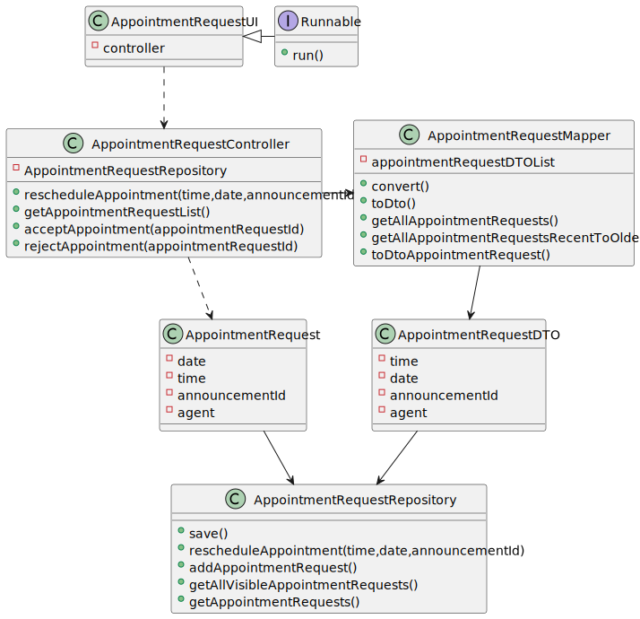

# US 006 - To create a Task 

## 3. Design - User Story Realization 

### 3.1. Rationale

**SSD - Alternative 1 is adopted.**

| Interaction ID | Question: Which class is responsible for... | Answer               | Justification (with patterns)                                                                                 |
|:-------------  |:--------------------- |:---------------------|:--------------------------------------------------------------------------------------------------------------|
| Step 1  		 |	... interacting with the actor? | AppointmentRequestUI         | Pure Fabrication: there is no reason to assign this responsibility to any existing class in the Domain Model. |
| 			  		 |	... coordinating the US? | AppointmentRequestController | Controller                                                                                                    |
| Step 2  		 |							 |                      |                                                                                                               |
| Step 3  		 |	...saving the inputted data? | AppointmentRequestRepository                 |                                                                |
| Step 4  		 |	...knowing the Appointment Request list to show? | Controller               |                                                         |
| Step 5  		 |	... sorting the Appointmen tRequests by oldest? | AppointmentRequestMapper                 |                                                    |
| Step 6  		 |							 |                      |                                                                                                               |              
| Step 7         |	... validating all data (global validation)? |  AppointmentRequestRepository         | IE: knows all its Appointment Requests. 
| 			  		 |	... validating all data (global validation)? | Organization         | IE: knows all its tasks.                                                                                      | 
| 			  		 |	... saving the rescheduled Appointment Request/ or update its status? | AppointmentRequestRepository        | IE: owns all its Appointment Requests                                                                                      | 
| Step 8  		 |	... informing operation success?| AppointmentRequestUI         | IE: is responsible for user interactions.                                                                     | 

## 3.2. Sequence Diagram (SD)

### Alternative 1 - Full Diagram

This diagram shows the full sequence of interactions between the classes involved in the realization of this user story.

## 3.3. Class Diagram (CD)

