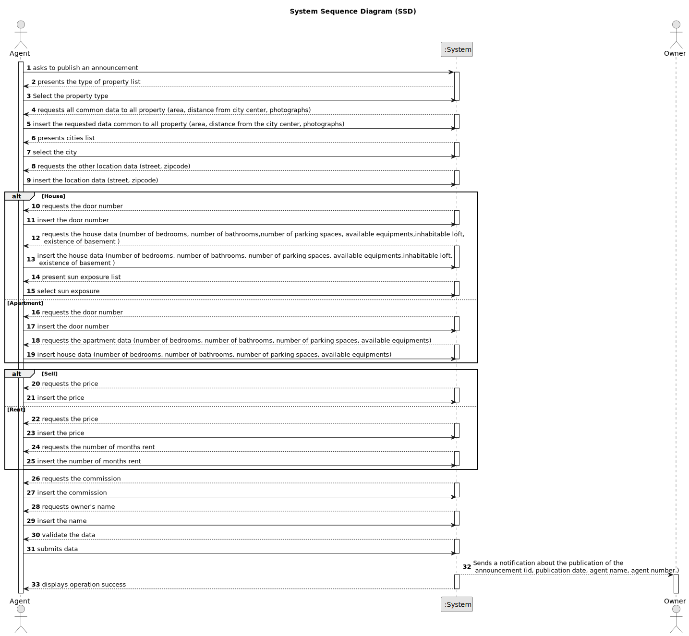

# US 002 - PUBLISH ANY SALE ANNOUNCEMENT ON THE SYSTEM 
## 1. Requirements Engineering

### 1.1. User Story Description

As an agent, I can publish any sale announcement on the system.

### 1.2. Customer Specifications and Clarifications 

**From the specifications document:**

>  From time to time, property owners contact Real Estate USA with the aim of selling or renting their properties.
>  Owners go to one of the company's branches and meet with a real estate agent to sell or rent one or more properties, or they can use the company's application for the same purposes.
>  The owner provides property characteristics and the requested price and sends the request to an agent. Upon receiving the order, the agent sets the commission and publishes the offer in the system. The commission can be a fixed amount or a percentage.
> In the case of a request for the sale of a property, the owner must provide information on: the type of property (apartment, house or land), the area in m2, the location, the distance from the city centre, the requested price and one or more photographs.
> If the property is an apartment or a house, the owner also provides: the number of bedrooms, the number of bathrooms, the number of parking spaces and the available equipment, such as central heating and/or air conditioning. In case the property is a house, the existence of a basement, an inhabitable loft, and sun exposure must be registered as well.

**From the client clarifications:**

> **Question:** Can the Client see the list of available houses in all the branches?
>  
> **Answer:** Yes.

> **Question:** How does the agent determine whether it is a fixed commission or a percentage commission?
>  
> **Answer:** The agent should choose the type of commission and enter the value.

> **Question:** Is the phone call the only way the agent can receive the sale announcement? Or he can receive them via e-mail/letter/etc.
>
> **Answer:** For now this is the only way.

> **Question:** Is it mandatory for the agent to input the commission value before publishing an announcement?
> 
> **Answer:** Yes.

> **Question**: When the agent receives the phone is it the agent who registers the order in the system or has the order already been entered into the system by the owner?
> Or is the phone call just for the owner to tell the agent that he registered a request in the system?
> 
> **Answer:** The agent registers the order in the system.

### 1.3. Acceptance Criteria

* **AC1:** A property needs to be registered to be published;
* **AC2:** All characteristics of the property , as well as its price; must be provided;
* **AC3:** An agent can publish more than one advertisement;
* **AC4:** An announcement can only be published once;
* **AC5:** The publication of an advertisement is withdrawn when the property is sold;
* **AC6** An SMS notification should be sent to the owner when the listing of the
property becomes available.
* **AC7** The notification must include the property identification and the date it
became available. 
* **AC8** The Notification must include the name and phone number of the
responsible Agent.
* **AC8** The commission, the area, the price, the distance from the city center, the location are mandatory data.

### 1.4. Found out Dependencies

* There is dependency on US3 - Register a new employee, as the agent needs to be registered to post an ad.

### 1.5 Input and Output Data

**Input Data:**

* Typed data:
  * Photo
  * Area
  * Location
  * Distance from city center
  * Price
  * Commission
  * House/Apartment
    * Number of bedrooms
    * Number of bathrooms
    * Number of equipment 
    * Number of parking spaces 
  * House
    * Existence of a basement 
    * Loft 
  * Rent
    * Number of months rent 
 
	
* Selected data:
	* Type of property
        * House
        * Apartment
        * Land
    * Sun exposure
      * North
      * South
      * East
      * West
    * Type of Business
      * Sell
      * Rent
    * City

**Output Data:**

* City List
* Type of Business list
* Type of Property list
* Sun exposure list
* (In)Success of the operation

### 1.6. System Sequence Diagram (SSD)

### 1.7 Other Relevant Remarks

N/A