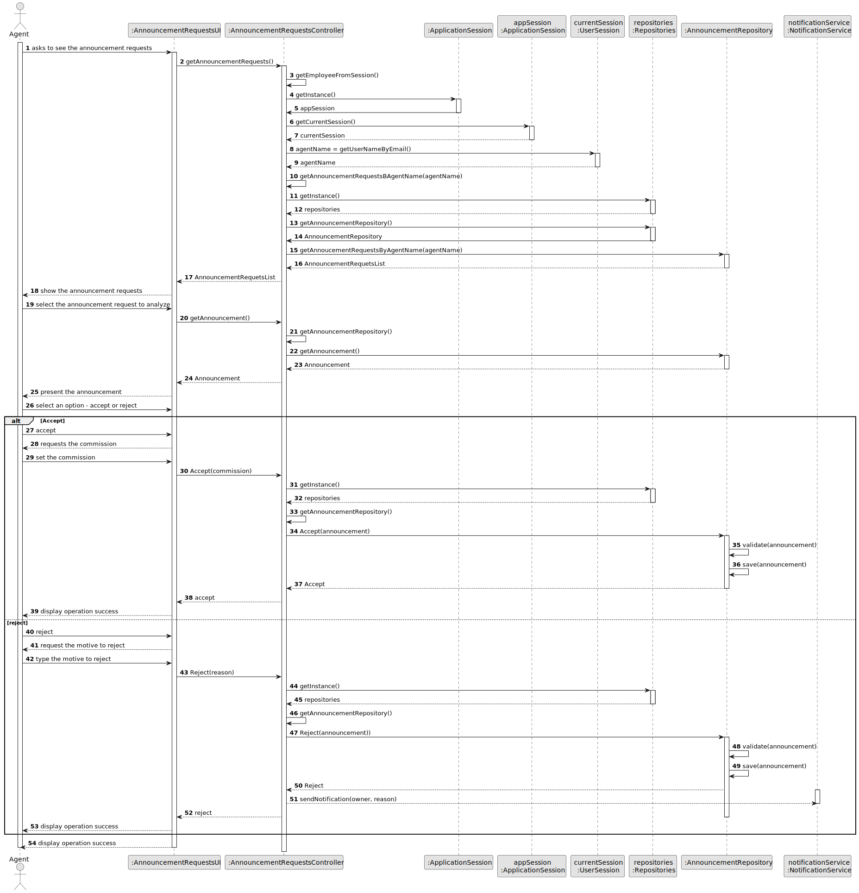
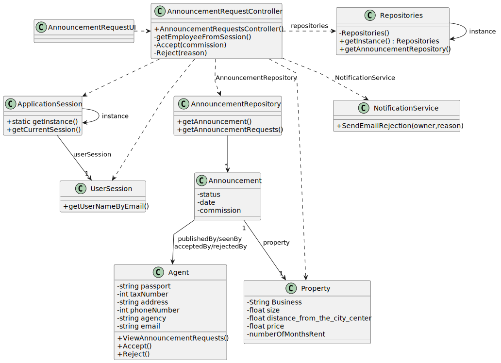

# US 008 - View announcement requests, review and approve/reject

## 3. Design - User Story Realization

### 3.1. Rationale

**SSD**

| Interaction ID                                                         | Question: Which class is responsible for...                  | Answer                         | Justification (with patterns)                                                                                 |
|:-----------------------------------------------------------------------|:-------------------------------------------------------------|:-------------------------------|:--------------------------------------------------------------------------------------------------------------|
| Step 1 - asks to see announcement requests                             | 	... interacting with the actor?                             | AnnouncementRequestsUI         | Pure Fabrication: there is no reason to assign this responsibility to any existing class in the Domain Model. |
| 			  		                                                                | 	... coordinating the US?                                    | AnnouncementRequestsController | Controller                                                                                                    |
| 			  		                                                                | ... knowing the user using the system?                       | UserSession                    | IE: cf. A&A component documentation.                                                                          |
| Step 2 - show all announcement requests	                               | 		... provide all announcement requests?					                | AnnouncementRepository         |      IE: owns all its announcements.                                                                                                          |
| 			  		                                                                | ... display all requests?                                    | AnnouncemnetRequestsUI         | IE: is responsible for user interactions                                                                      |
| Step 3 - select the announcement request to analyze		                  | 	                                                            |                                |                                       |
| Step 4 - presents all the datas about the announcement request choosed | 	...provide the announcement choosed?                        | AnnouncementRepository         |   IE: owns all its announcements.                                                                                                            |
| 			  		                                                                | ... display the information about the annoucement?           | AnnouncemnetRequestsUI         | IE: is responsible for user interactions                                                                      |
| Step 5 - Approve/reject  -                                             | 	...saving and processing the option choosed?                | AnnouncementRepository         | IE                                                               |
| Step 6                                                                 | 					                                                        |                                |                                                                                                               |              
| Step 7                                                                 | 	           |                  |                                                                      | 
| 			  		                                                                |                |        |                                                                               | 
| 			  		                                                                | 	                      |         |                                                                                | 
| Step 8  - displays operation sucess	                                   | 	... informing operation success?                            | PublishAnnouncementUI          | Pure Fabrication.                                                                                             | 

### Systematization ##

According to the taken rationale, the conceptual classes promoted to software classes are:

* Announcement
* Agent
* Property

Other software classes (i.e. Pure Fabrication) identified:
* AnnouncementRepository
* AnnouncementRequestsUI
* AnnouncementRequestsController

## 3.2. Sequence Diagram (SD)

### Full Diagram

This diagram shows the full sequence of interactions between the classes involved in the realization of this user story.

#
## 3.3. Class Diagram (CD)

