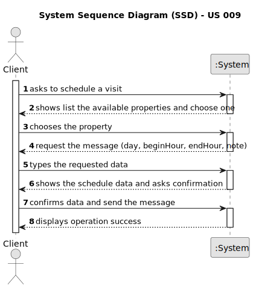

# US 009 - Sends a message to schedule a visit 

## 1. Requirements Engineering

### 1.1. User Story Description

As a client, I want to leave a message to the agent to schedule a visit to a
property of my interest.

### 1.2. Customer Specifications and Clarifications 

**From the specifications document:**

>	Among these operations are the publication of rental
and sale advertisements, the registration of a business (lease or sale) and the scheduling and
registration of visits to the property.

>	All registered information, except the agency commission, can be accessed by the client who intends to
buy or rent the property; 

>	 The client is, then, responsible for being able to consult the properties by
type, number of rooms, and sort by criteria such as price or the city where the property is located.

>	After consulting a list of properties, the client can request to schedule a visit to the real estate agent
for a specific property to verify its conditions. The agent receives the request, checks the
availability and sends the response. If the customer accepts the order, it is automatically scheduled
in the system.

**From the client clarifications:**

> **Question:** AC1. A list of available properties must be shown, sorted from the most recent entries to the oldest. Assuming that this is done so the client can see the available properties in order to select one and given that in a previous question you've stated that the required information for the message should be typed then, for this US, is the only selected data the property that the client wishes to visit?
>  
> **Answer:** Q: Assuming that this is done so the client can see the available properties in order to select one and given that in a previous question you've stated that the required information for the message should be typed then, for this US, is the only selected data the property that the client wishes to visit?
A: System behavior must be consistent. For instance, the filters to be applied when the client is viewing a list of properties should be similar to the filters used in US1.

> **Question:** Assuming that this is done so the client can see the available properties in order to select one and given that in a previous question you've stated that the required information for the message should be typed then, for this US, is the only selected data the property that the client wishes to visit?
>  
> **Answer:** System behavior must be consistent. For instance, the filters to be applied when the client is viewing a list of properties should be similar to the filters used in US1.

>  **Question:**  In AC2, when the suggestion of date and time is sent, is there a standard duration for the visit or is it mandatory to fill in a start time and an end time for the visit?
>
> **Answer:** There is no standard duration to schedule a visit. The client should define his availability specifying the start time and the end time for the visit.

>  **Question:**   In AC2, can any time be used or are we limited to certain hours?
>
> **Answer:** Any time can be used.

>  **Question:** Also in AC2, should we use the 12am/pm or 24-hour time format?
>
> **Answer:** Please use 24-hour time format.

### 1.3. Acceptance Criteria

* **AC1:** All required fiels must be filled in.
* **AC2:** Phone number must have at 10 numbers.
* **AC3:** When the typed date is already in the scheduled list of a property, the user must insert another one.
* **AC4:** A list of available properties must be shown, sorted from the most recent
  entries to the oldest. 
* **AC5:** The message must also include the client's name, phone number,
	preferred date and time slot (from x hour to y hour) for the property visit.
* **AC6:** A client may post multiple visit requests, but only if those do not overlap
  each other.
* **AC7:** The client must receive a success message when the request is valid and
  registered in the system.

### 1.4. Found out Dependencies

* There is a dependency on the AnnouncementsRepository.

### 1.5 Input and Output Data

**Input Data:**

* Typed data:
	* a name, 
	* a phone number, 
	* a day,
	* a begin hour,
    * a end hour,
    * a note;
  
	
* Selected data:
	* Property selection
    * Property filter selection

**Output Data:**

* (In)Success of the operation
* Message of the agent

### 1.6. System Sequence Diagram (SSD)

**Other alternatives might exist.**

#### Alternative One

### 1.7 Other Relevant Remarks

* NA