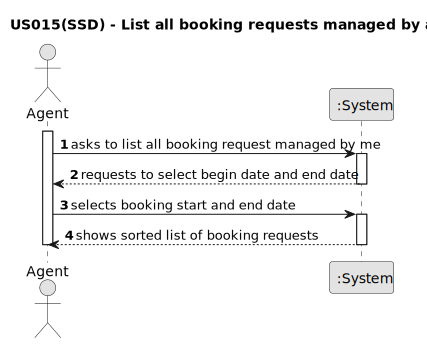

# US 015 - List all booking requests managed by agent

## 1. Requirements Engineering

### 1.1. User Story Description

As an agent, I intend to list all booking requests for properties managed by
me. 

### 1.2. Customer Specifications and Clarifications 

**From the specifications document:**

>After consulting a list of properties, the client can request to schedule a visit to the real estate agent
for a specific property to verify its conditions. 

**From the client clarifications:**

>Question: Booking is a slightly vague word. Our team wants clarifications on what type of requests the word encompasses (visit requests being our strongest guess, but we are not sure).

>Answer: It is a visit request.

>Question: US015's AC1 states that "The list of requests must be shown for a specific period (begin date, end date)". As such, our team would like to know if you want this time period to be selected or typed, and in which format it should be in.

>Answer: The dates should be selected. The format should be DD-MM-YYYY.

>Question: In US015's AC1, it is stated that "The list of requests must be shown for a specific period (begin date, end date)."
This time period caused confusion, as the team is unsure whether the "date" is referring to the date chosen by the client in the message (See US009's requirements) or the date of creation of the visit request.

>Answer: The goal is to use the date chosen by the client (the preferred date that you can see in US9) to list booking requests.

>Question:

>Answer:

### 1.3. Acceptance Criteria

* AC1. The list of requests must be shown for a specific period (begin date, end
date).

* AC2. The list of requests must be sorted by date in ascending order. The sorting
algorithm to be used by the application must be defined through a configuration
file. At least two sorting algorithms should be available. 

### 1.4. Found out Dependencies

* US009

### 1.5 Input and Output Data

**Input Data:**

**Selected Data:**
    
    -Begin date;
    -End date;

**Output Data:**

* Sorted in asceding order booking requests list

### 1.6. System Sequence Diagram (SSD)

**Other alternatives might exist.**

