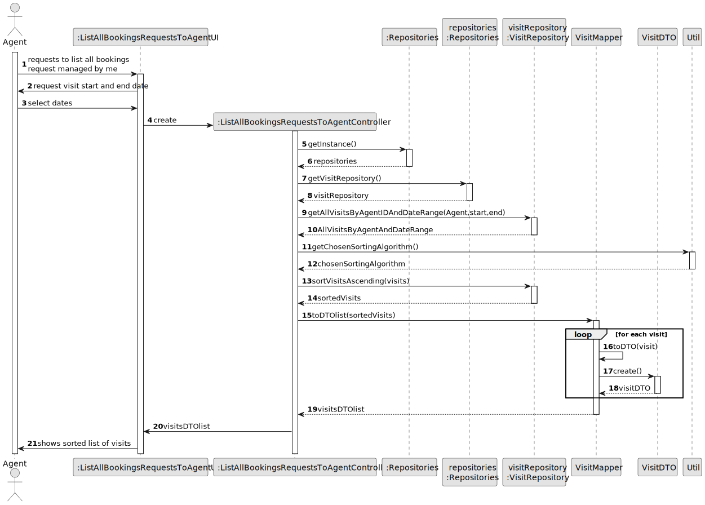
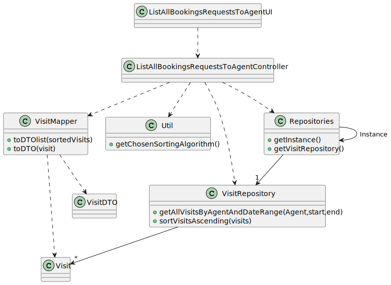

# US 015 - List all booking requests managed by agent

## 3. Design - User Story Realization

### 3.1. Rationale

| Interaction ID | Question: Which class is responsible for...  | Answer                     | Justification (with patterns)                                                                                 |
|:---------------|:---------------------------------------------|:---------------------------|:--------------------------------------------------------------------------------------------------------------|
| Step 1  		     | 	... interacting with the actor?             | ListAllBookingRequestsToAgentUI           | Pure Fabrication: there is no reason to assign this responsibility to any existing class in the Domain Model. |
| 			  		        | 	... coordinating the US?                    | ListAllBookingRequestsToAgentController   | Controller                                                                                                    |                                                                                                             |
| 			  		        | ... knowing the user using the system?       | UserSession                | IE: cf. A&A component documentation.                                                                          |                                                                     |                                                                                    | 
| Step 2  		     | 	... informing operation success?            | ListAllBookingRequestsToAgentUI         | IE: is responsible for user interactions.                                                                     | 

Other software classes (i.e. Pure Fabrication) identified:

* ListAllBookingRequestsToAgentUI
* ListAllBookingRequestsToAgentController

## 3.2. Sequence Diagram (SD)

## 3.3. Class Diagram (CD)

