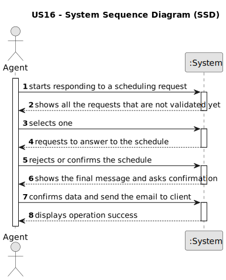

# US 016 - To validate an appointment for a visit  

## 1. Requirements Engineering

### 1.1. User Story Description

As an agent, when viewing a booking request, I want to respond to the user
that scheduled the visit.

### 1.2. Customer Specifications and Clarifications 

**From the specifications document:**

>	After consulting a list of properties, the client can request to schedule a visit to the real estate agent
for a specific property to verify its conditions. The agent receives the request, checks the
availability and sends the response. If the customer accepts the order, it is automatically scheduled
in the system.

**From the client clarifications:**
**VER O FORUM DO MOODLE:**
> **Question:** Which is the unit of measurement used to estimate duration?
>  
> **Answer:** Duration is estimated in days.

> **Question:** Monetary data is expressed in any particular currency?
>  
> **Answer:** Monetary data (e.g. estimated cost of a task) is indicated in POTs (virtual currency internal to the platform).

### 1.3. Acceptance Criteria

* **AC1:** The response is sent by email.
* **AC2:** Different email services can send the message. These services must be
  configured using a configuration file to enable using different platforms (e.g.:
  gmail, DEI's email service, etc.)
* **AC3:** The response should include the name and phone number of the
  responsible Agent.
* **AC4:** The response should include the property identification and location.
* **AC5:** When an Agent responds to a booking request the list of booking requests
  should be updated to not show this request.

### 1.4. Found out Dependencies

* There is a dependency to "US004 Schedule visit request" because for the agent answers the client, a schedule request must exist.

### 1.5 Input and Output Data

**Input Data:**

* Typed data:
	* the answer to the request
	
* Selected data:
	* Select the request that the agent wants to validate

**Output Data:**

* List of existing schedule requests
* (In)Success of the operation

### 1.6. System Sequence Diagram (SSD)

### 1.7 Other Relevant Remarks

N/A.