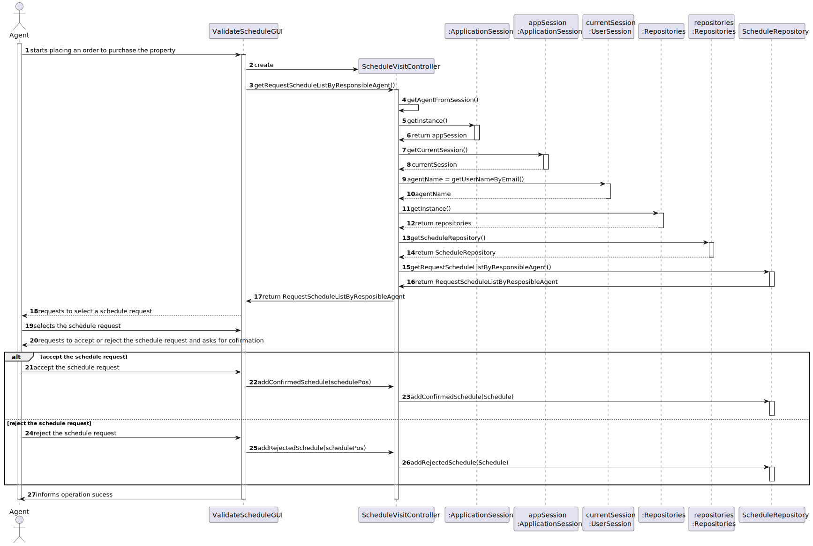

# US 016 - To validate an appointment for a visit

## 3. Design - User Story Realization 

### 3.1. Rationale

**SSD - Alternative 1 is adopted.**

| Interaction ID | Question: Which class is responsible for...  | Answer                  | Justification (with patterns)                                                                                 |
|:-------------  |:---------------------------------------------|:------------------------|:--------------------------------------------------------------------------------------------------------------|
| Step 1  		 | 	... interacting with the actor?             | ValidateVisitUI         | Pure Fabrication: there is no reason to assign this responsibility to any existing class in the Domain Model. |
| 			  		 | 	... coordinating the US?                    | ScheduleVisitController | Controller                                                                                                    |
                                                      |
| 			  		 | ... knowing the user using the system?       | UserSession             | IE: cf. A&A component documentation.                                                                          |
| 			  		 | 							                                      | Employee                | IE: knows its own data (e.g. email)                                                                                                                |
| 			  	                                                                          |
| Step 2  		 | 							                                      |                         |                                                                                                               |
| Step 3  		 | 	...saving the inputted data?                | Schedule                | IE: object created in step 1 has its own data.                                                                |
| Step 4  		 | 	...knowing the task categories to show?     | System                  | IE: Task Categories are defined by the Administrators.                                                        |
| Step 5  		 | 	... saving the selected category?           | Task                    | IE: object created in step 1 is classified in one Category.                                                   |
| Step 6  		 | 							                                      |                         |                                                                                                               |              
| Step 7  		 | 	... validating all data (local validation)? | Task                    | IE: owns its data.                                                                                            | 
| 			  		 | 	... validating all data (global validation)?| Organization            | IE: knows all its tasks.                                                                                      | 
| 			  		 | 	... saving the created task?                | Organization            | IE: owns all its tasks.                                                                                       | 
| Step 8  		 | 	... informing operation success?            | CreateTaskUI            | IE: is responsible for user interactions.                                                                     | 

### Systematization ##

According to the taken rationale, the conceptual classes promoted to software classes are: 

 * Schedule

Other software classes (i.e. Pure Fabrication) identified: 

 * ValidateVisitUI  
 * ScheduleVisitController
 * Repositories
 * ScheduleRepository
 * ApplicationSession
 * UserSession

## 3.2. Sequence Diagram (SD)

## 3.3. Class Diagram (CD)

