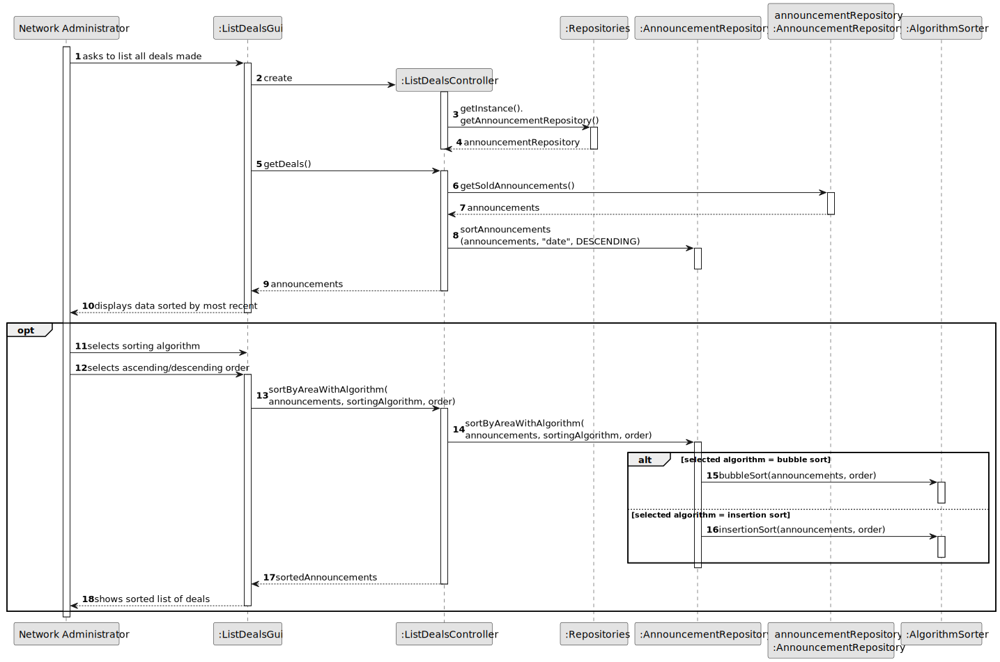
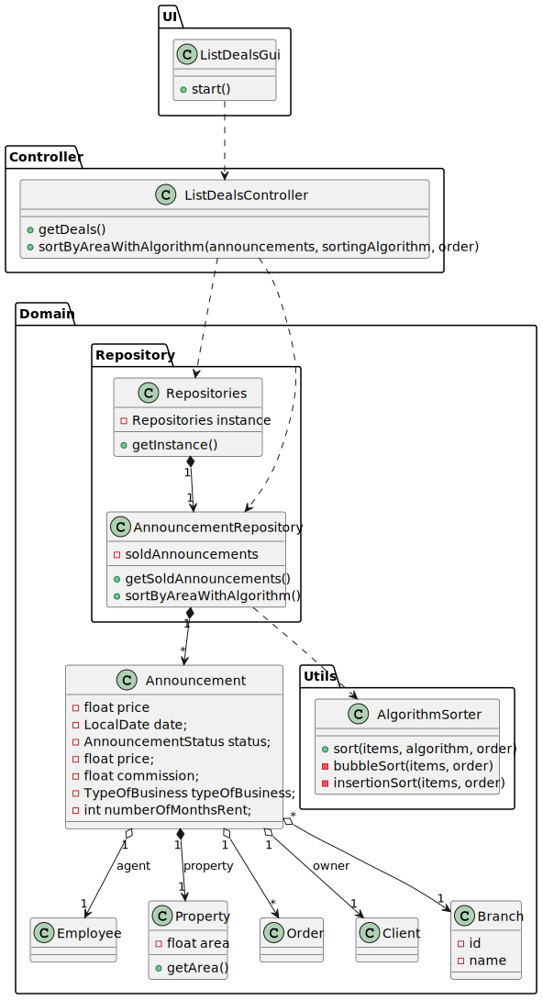

# US 006 - To create a Task 

## 3. Design - User Story Realization 

### 3.1. Rationale

**SSD - Alternative 1 is adopted.**

| Interaction ID | Question: Which class is responsible for...            | Answer                 | Justification (with patterns)                                                                                                                                          |
|:---------------|:-------------------------------------------------------|:-----------------------|:-----------------------------------------------------------------------------------------------------------------------------------------------------------------------|
| Step 1  		     | 	... interacting with the actor?                       | ListDealsUI            | Information Expert: responsible for user interaction Pure Fabrication: there is no reason to assign this responsibility to any existing class in the Domain Model. |
| 			  		        | 	... coordinating the US?                              | ListDealsController    | Controller: controls the flow of the US.                                                                                                                               |
| 			  		        | 	... maintaining a single instance of repositories?    | Repositories           | Singleton                                                                                                                                                              |
| 			  		        | 	... obtaining the AnnouncementRepository instance?    | Repositories           | Information Expert: knows all Repositories                                                                                                                             |
| 			  		        | 	... obtaining the list of announcements?              | AnnouncementRepository | Information Expert: knows all Announcements                                                                                                                            |
| 			  		        | ... sorting announcements by date?                     | AnnouncementRepository | Information Expert: knows all Announcements                                                                                                                            |
| 			  		        | ... comparing dates?                                   | Announcement           | Information Expert: knows its own information                                                                                                                          |
| 			  		        | 	... displaying the announcements?					                | ListDealsUI            | Information Expert: responsible for user interaction                                                                                                                   |
| 			  		        | 	... requesting data from the selectable fields?						 | ListDealsUI            | Information Expert: responsible for user interaction                                                                                                                   |
| 			  		        | ... sorting announcements by property area?            | AnnouncementRepository | Information Expert: knows all Announcements                                                                                                                            |
| 			  		        | ... comparing property areas?                          | Property               | Information Expert: knows its own information                                                                                                                          |
 

### Systematization ##

According to the taken rationale, the conceptual classes promoted to software classes are: 

 * Announcement
 * Property

Other software classes (i.e. Pure Fabrication) identified: 

 * ListDealsUI 
 * ListDealsController
 * Repositories
 * AnnouncementRepository

## 3.2. Sequence Diagram (SD)

### Alternative 1 - Full Diagram

This diagram shows the full sequence of interactions between the classes involved in the realization of this user story.

## 3.3. Class Diagram (CD)

