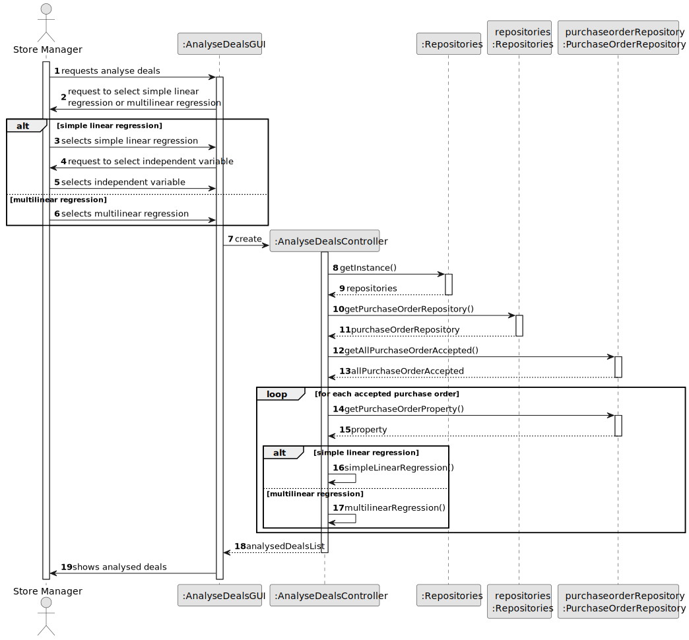
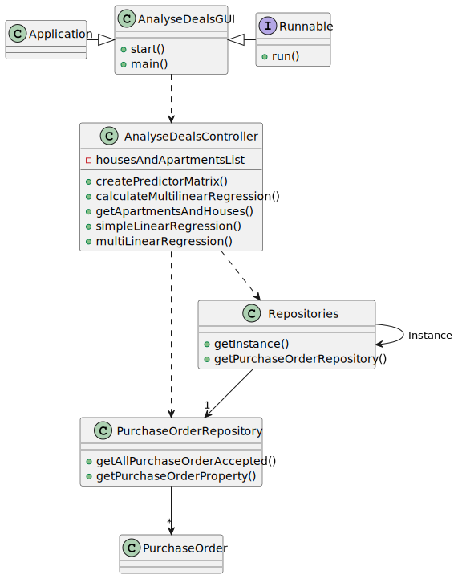

# US 018 - Analyse the deals made, based on the characteristics of the property using simple liner regression and multilinear regression

## 3. Design - User Story Realization 

### 3.1. Rationale

**SSD - Alternative 1 is adopted.**

| Interaction ID | Question: Which class is responsible for... | Answer               | Justification (with patterns)                                                                                 |
|:-------------  |:--------------------- |:---------------------|:--------------------------------------------------------------------------------------------------------------|
| Step 1  		 |	... interacting with the actor? | AnalyseDealsUI         | Pure Fabrication: there is no reason to assign this responsibility to any existing class in the Domain Model. |
| 			  		 |	... coordinating the US? | AnalyseDealsController | Controller                                                                                                    |
| 			  		 |	... instantiating a new Regression Model? | AnalyseDealsController   | Creator (Rule 1): in the DM AnalyseDealsController has a Regression Model.                                                          |
| 			  		 | ... knowing the user using the system?  | UserSession          | IE: cf. A&A component documentation.                                                                          |
| 			  		 |	... knowing the properties data for analysis?	 | AnalyseDealsController         | IE: knows/has its own Property data                                                                             |                                                                     |
| Step 2  		 |	... running this selection regression model						 |   AnalyseDealsController                   |   IE: object created in step 1 runs its own model.                                                                                                            |
| Step 3  		 |	.. displaying the regression model, estimated prices, and statistics? | AnalyseDealsUI   | IE: is responsible for user interactions.                                                               |
                                                                  

### Systematization ##

According to the taken rationale, the conceptual classes promoted to software classes are: 

* PurchaseOrder

Other software classes (i.e. Pure Fabrication) identified: 

 * AnalyseDealsUI
 * AnalyseDealsController

## 3.2. Sequence Diagram (SD)

### Alternative 1 - Full Diagram

This diagram shows the full sequence of interactions between the classes involved in the realization of this user story.

## 3.3. Class Diagram (CD)

