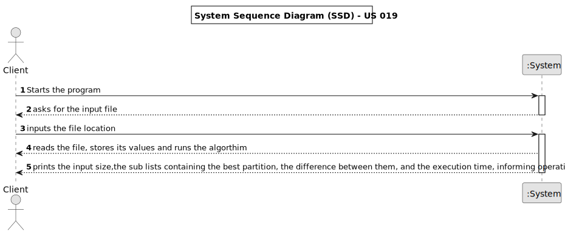

# US 019 - Optimal Partition

## 1. Requirements Engineering

### 1.1. User Story Description

As a network manager, I want to divide the set of all stores into two subsets,so that the total number of properties of the stores between the two subsets is the closest possible.

### 1.2. Customer Specifications and Clarifications 

**From the specifications document:**

>	The manager of the network intends to analyze the performance of each of the branches and the global behavior of the network on a daily basis.

>	The main functions of a store manager are to monitor and streamline the branch with the aim of getting to know better the business carried out and to analyze and evaluate the performance of employees."
This quote emphasizes the responsibilities of a store manager, including optimizing branch operations and evaluating employee performance.

**From the client clarifications:**

> **Question:** Dear Client,

Should the CSV legacy file be used as a file that has the purchase orders that were accepted and therefore be used in the US019 or does the CSV file not contain the type of deals we are looking for?

Best regards,
>  
> **Answer:** In USs 17, 18 and 19, the network manager and the store manager should be able to explore/analyze ALL deals that are registered in the system.
To develop the work required by MATCP and MDISC courses, you should have a clean/empty system and you should load the CSV file that is already available in moodle (please the link "CSV file generated by the legacy system to be explored in US17, US18 and US19" available in moodle).

> **Question:** Does it include only properties that are announced or does it also include properties that are pending agent approval for announcement.
>  
> **Answer:** Please consider properties whose the purschase order was accepted. In other words, deals that were done/made.

### 1.3. Acceptance Criteria

* **AC1:** The application should implement a brute-force algorithm, an algorithm which consists of calculating all the partitions of cardinal 2 and finding out which one is the minimum for the difference of the sum of the elements of each sublist.
* **AC2:** The algorithm should return the sublists of the partition (each sublist shouldcontain a set of tuples with two elements each, the storeID and the number of properties manage by the store) that satisfies the stated condition and also the difference between the sums of the elements of the sublists. In the user manual,this algorithm must be written in pseudocode.
* **AC3:** Runtime tests for variable length n input lists, with com n = 3, 6, 9, …, 30 (asymptotic behavior) should be performed. In each run the number of stores should be chosen sequentially. In the user manual, the results of measuring the time of each algorithm for one/several inputs of the same size, as also the graphic
* ** of the asymptotic behavior of the execution time should be presented (use a unit of time that allows you to distinguish the running times of all tested examples). Also, it should be presented the input list, the two sublists that make up the partition and difference of sums, for at least one example of each input size.

### 1.4. Found out Dependencies

* There is a dependency to "US 012 - Import data from a legacy system" since it needs to import data from it.

### 1.5 Input and Output Data

**Input Data:**

* Typed data:
* File Path

**Output Data:**

* Sublists of the optimal partition and their difference
* Execution time
* (In)Success of the operation

### 1.6. System Sequence Diagram (SSD)

**Other alternatives might exist.**

#### Alternative One

