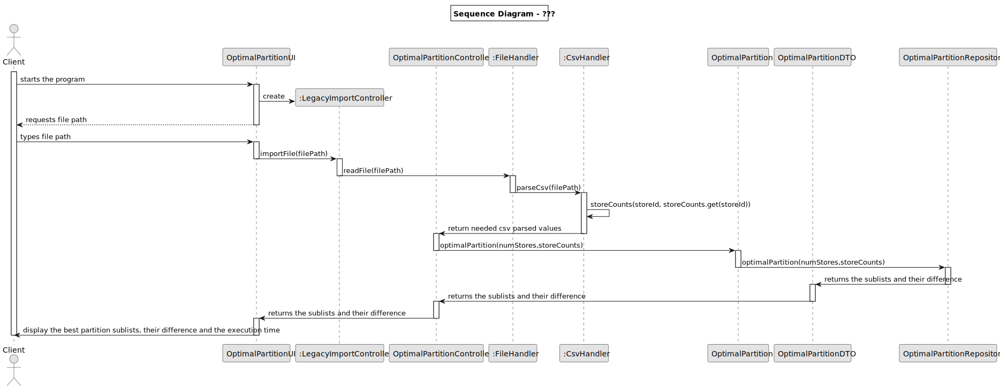
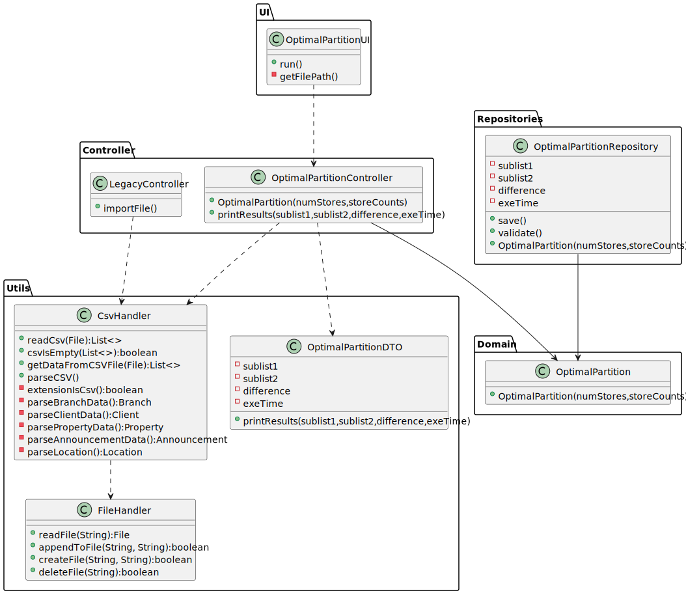

# US 019 - Optimal Partition

## 3. Design - User Story Realization 

### 3.1. Rationale

**SSD - Alternative 1 is adopted.**

| Interaction ID | Question: Which class is responsible for... | Answer               | Justification (with patterns)                                                                                 |
|:-------------  |:--------------------- |:---------------------|:--------------------------------------------------------------------------------------------------------------|
| Step 1  		 |	... interacting with the actor? | OptimalPartitionUI         | Pure Fabrication: there is no reason to assign this responsibility to any existing class in the Domain Model. |
| 			  		 |	... coordinating the US? | OptimalPartitionController | Controller                                                                                                    |
| 			  		 |	... instantiating a new Legacy syste,? | LegacySystemUI         |                                                        |
| Step 2  		 |							 |                      |                                                                                                               |
| Step 3  		 |	...handling the inputted data? | CsvHandler                 |                                                              |
| Step 4 		 |	... validating all data (global validation)? | OptimalPartitionRepository                | IE: owns its data.                                                                                            |                                                                                     | 
| 			  		 |	... saving the results? | OptimalPartitionRepository        |                                                                                        | 
| Step 8  		 |	... informing operation success?| OptimalPartitionUI       | IE: is responsible for user interactions.                                                                     | 

## 3.2. Sequence Diagram (SD)

### Alternative 1 - Full Diagram

This diagram shows the full sequence of interactions between the classes involved in the realization of this user story.

## 3.3. Class Diagram (CD)

