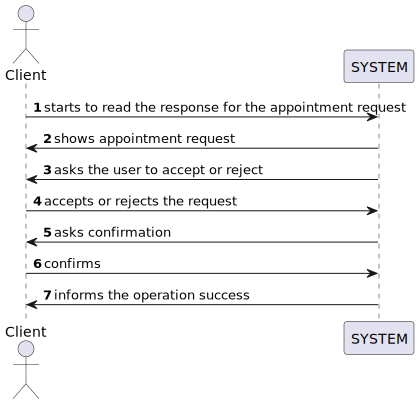
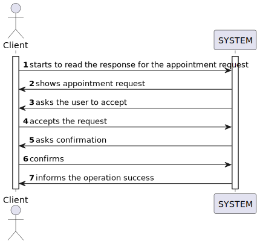
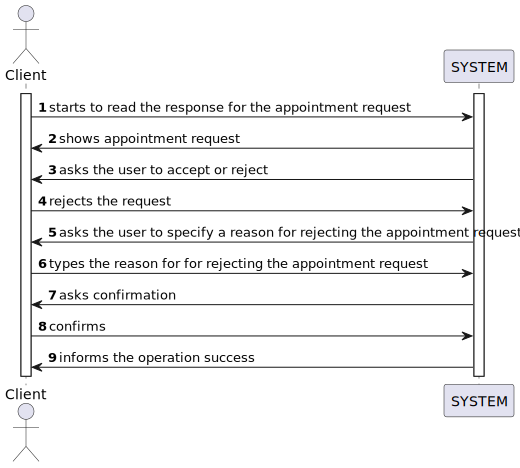

# US 020 - As a client, I want to read the response for the appointment request, to accept or reject it

## 1. Requirements Engineering

### 1.1. User Story Description

As a client, I want to read the response for the appointment request, to accept or reject it.

### 1.2. Customer Specifications and Clarifications 

**From the specifications document:**

>	After consulting a list of properties, the client can request to schedule a visit to the real estate agent
    for a specific property to verify its conditions. The agent receives the request, checks the
    availability and sends the response. If the customer accepts the order, it is automatically scheduled
    in the system.

**From the client clarifications:**

> **Question:** "The reason for declining the appointment should be selected from predefined options or entered as free text?"
>  
> **Answer:** "The message should be entered as free text."

> **Question:** "According to AC1, the agent must be notified when the message is displayed to the client. Should he receive an email?"
>  
> **Answer:** "The agent must be notified by email when the message is displayed to the client."

> **Question:** "Should the response for the booking request be displayed in the console? Or is it implied that the client saw the response in the email and knows what is being handled?"
>
> **Answer:** "The agent must be notified by email when the message is displayed to the client."

### 1.3. Acceptance Criteria

* **AC1:** The agent must be notified when the message is displayed to the client
 
* **AC2:** The appointment request must provide information about the property and the date of the appointment
 
* **AC3:** When the appointment is rejected, the client must specify the reason

* **AC4:** The appointment request must provide the agent name and phone number

### 1.4. Found out Dependencies

* The system must have appointment request already registered (US009). The system must have an announcement already 
  registered (US002).

### 1.5 Input and Output Data

**Input Data:**

* Typed data:
 

	* In case the client rejects the appointment request - reason
	 

	
* Selected data:

	* appointment request

**Output Data:**

    *  Request confirmation
	*  Success of the operation
	*  List of schedules

### 1.6. System Sequence Diagram (SSD)

### Alternative 1 - Full Diagram

### Alternative 2

This diagram shows the sequence of interactions when the client accepts the appointment request

### Alternative 3

This diagram shows the sequence of interactions when the client rejects the appointment request

### 1.7 Other Relevant Remarks

* N/A