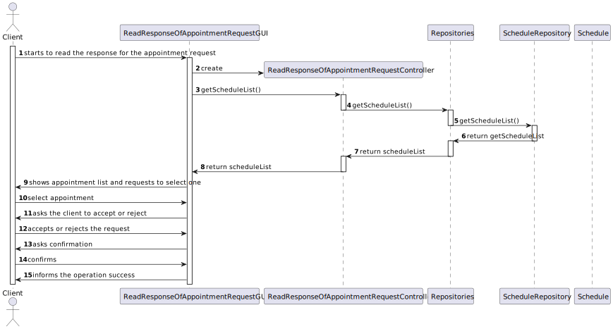
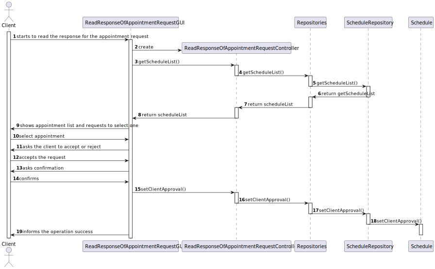
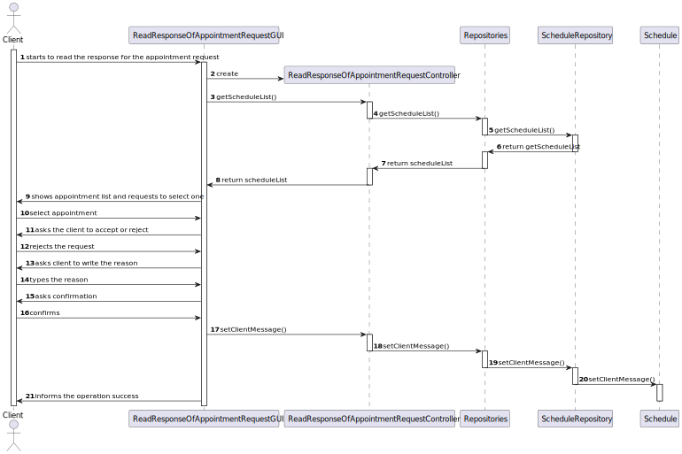

# US 020 - As a client, I want to read the response for the appointment request, to accept or reject it

## 3. Design - User Story Realization 

### 3.1. Rationale

| Interaction ID  | Question: Which class is responsible for...                | Answer                                     | Justification (with patterns)                                                                                 |
|:----------------|:-----------------------------------------------------------|:-------------------------------------------|:--------------------------------------------------------------------------------------------------------------|
| Step 1  	       | ... interacting with the actor?                            | ReadResponseOfAppointmentRequestGUI        | Pure Fabrication: there is no reason to assign this responsibility to any existing class in the Domain Model. |
| 			  		         | 	... coordinating the US?                                  | ReadResponseOfAppointmentRequestController | Controller                                                                                                    |
| 			  		         | 	... knowing the user using the system?                    | UserSession                                | IE: cf. A&A component documentation.                                                                          |
| Step 2  		      | ...holding the instance of the schedule repository 							 | Repositories                               | Singleton                                                                                                     |
| Step 3  		      | ...holding the schedule list	                              | ScheduleRepository                         | Repository                                                                                                    |
| Step 4  		      | ...having the necessary atributes of the schedule	         | Schedule                                   |                                                                                                               |
| Step 5  		      | ...saving the input data?	                                 | Schedule                                   |                                                                                                               |
| Step 6  		      | ...informing operation success							                      |ReadResponseOfAppointmentRequestGUI                                            |                                                                                                               |              

### Systematization ##

According to the taken rationale, the conceptual classes promoted to software classes are: 

 *   Schedule

Other software classes (i.e. Pure Fabrication) identified: 

 *   ReadResponseOfAppointmentRequestGUI
 *   ReadResponseOfAppointmentRequestController
 *   ScheduleRepository
 *   Repositories

## 3.2. Sequence Diagram (SD)

### Alternative 1 - Full Diagram

This diagram shows the full sequence of interactions between the classes involved in the realization of this user story.

### Alternative 2

This diagram shows the sequence of interactions when the client accepts the appointment request

### Alternative 3

This diagram shows the sequence of interactions when the client rejects the appointment request

## 3.3. Class Diagram (CD)

