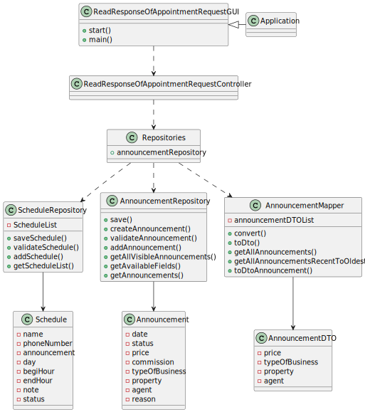

# US 020 - As a client, I want to read the response for the appointment request, to accept or reject it

## 3. Design - User Story Realization 

### 3.1. Rationale

| Interaction ID  | Question: Which class is responsible for...  | Answer               | Justification (with patterns)                                                                                 |
|:----------------|:---------------------------------------------|:---------------------|:--------------------------------------------------------------------------------------------------------------|
| Step 1  	       | ... interacting with the actor?              |ReadResponseOfAppointmentRequestGUI          | Pure Fabrication: there is no reason to assign this responsibility to any existing class in the Domain Model. |
| 			  		         | 	... coordinating the US?                    | ReadResponseOfAppointmentRequestController | Controller                                                                                                    |
| 			  		         | 	... knowing the user using the system?      |   UserSession          |  IE: cf. A&A component documentation.                                                          |
| Step 2  		      | 							                                      |                      |                                                                                                               |
| Step 3  		      | 	                                            |                  |                                                                |
| Step 4  		      | 	                                            |                |                                                        |
| Step 5  		      | 	                                            |                  |                                                    |
| Step 6  		      | 							                                      |                      |                                                                                                               |              
| Step 7  		      | 	                                            |                  |                                                                                        | 
| Step 8  		      | 	                                            |          |                                                                     | 

### Systematization ##

According to the taken rationale, the conceptual classes promoted to software classes are: 

 *   Announcement
 *   AnnouncementDTO
 *   AnnouncementMapper
 *   Schedule

Other software classes (i.e. Pure Fabrication) identified: 

 *   ReadResponseOfAppointmentRequestGUI
 *   ReadResponseOfAppointmentRequestController
 *   AnnouncementRepository
 *   ScheduleRepository
 *   Repositories

## 3.2. Sequence Diagram (SD)

### Alternative 1 - Full Diagram

This diagram shows the full sequence of interactions between the classes involved in the realization of this user story.

## 3.3. Class Diagram (CD)

