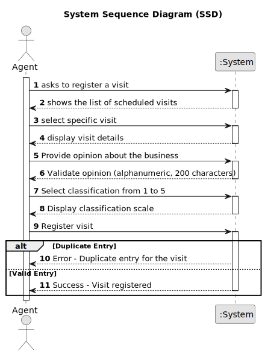

# US 021 -  Register Visit

## 1. Requirements Engineering

### 1.1. User Story Description

As an agent, at the end of the visit, I want to register the visit and the
opinion about the business.

### 1.2. Customer Specifications and Clarifications 

**From the specifications document:**

>	After consulting a list of properties, the client can request to schedule a visit to the real estate agent
for a specific property to verify its conditions. The agent receives the request, checks the
availability and sends the response. If the customer accepts the order, it is automatically scheduled
in the system.

>After carrying out the visit, the agent records the visit and an indication of whether or not he thinks
the deal will take place.

**From the client clarifications:**

> N/A

> N/A

### 1.3. Acceptance Criteria**

  * **AC1:** The opinion must be an alphanumeric type with 200 characters.
  * **AC2:** A classification scale from 1 (most improbable) to 5 (most probable) stating
  the agent opinion whether the deal will go through.
  * **AC3:** No duplicate entries for the same visit should be allowed.

### 1.4. Found out Dependencies

* There is dependency with US09, as it is necessary to have a visit request and with US16, because the visit needs to be accepted and scheduled

### 1.5 Input and Output Data

**Input Data:**

* Typed data:
	
    * Opinion about the deal
    
* Selected data:
	* Classification scale
    

**Output Data:**

* (In)Success of the operation

### 1.6. System Sequence Diagram (SSD)

**Other alternatives might exist.**

### 1.7 Other Relevant Remarks

* N/A