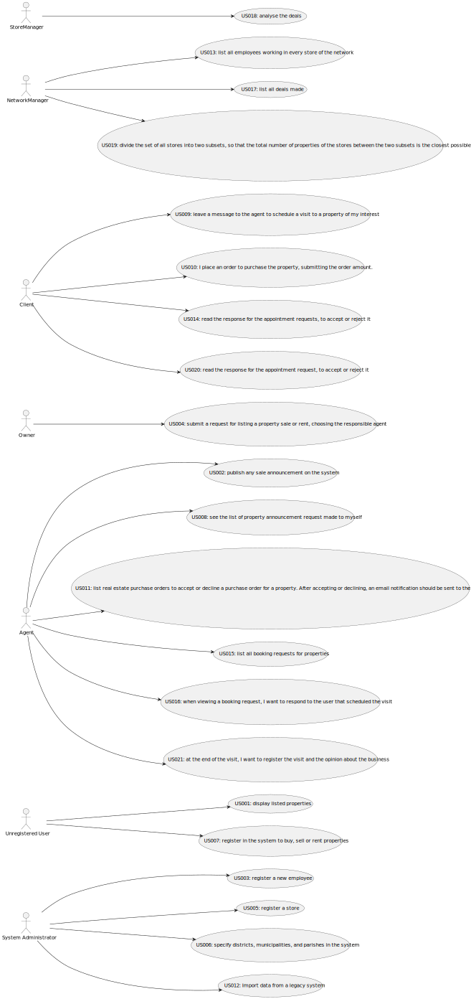

# Use Case Diagram (UCD)

**In the scope of this project, there is a direct relationship of _1 to 1_ between Use Cases (UC) and User Stories (US).**

However, be aware, this is a pedagogical simplification. On further projects and curricular units might also exist _1 to
N **and/or** N to 1 relationship between US and UC.

**Insert below the Use Case Diagram in a SVG format**

**For each UC/US, it must be provided evidences of applying main activities of the software development process (
requirements, analysis, design, tests and code). Gather those evidences on a separate file for each UC/US and set up a
link as suggested below.**

# Use Cases / User Stories

| UC/US  | Description                                                                                                       |                   
|:-------|:------------------------------------------------------------------------------------------------------------------|
| US 001 | [Display Listed Properties](../../us001/Readme.md)                                                                |
| US 002 | [Publish any Sale Announcement on the System](../../us002/Readme.md)                                              |
| US 003 | [Register a new Employee](../../us003/Readme.md)                                                                  |
| US 004 | [Submit a Request for Listing a Property Sale or Rent](../../us004/Readme.md)                                     |
| US 005 | [Register a Store](../../us005/Readme.md)                                                                         |
| US 006 | [Specify Districts, Municipalities, and Parishes in the System](../../US006/Readme.md)                            |
| US 007 | [Register in the system to buy, sell or rent properties](../../us007/Readme.md)                                   |
| US 008 | [See the list of property announcement request made to myself](../../us008/Readme.md)                             |
| US 009 | [Leave a message to the agent to schedule a visit to a  property of my interest](../../us009/Readme.md)           |
| US 010 | [Place an order to purchase the property](../../us010/Readme.md)                                                  |
| US 011 | [List real estate purchase orders to accept or decline a purchase order for a property](../../us011/Readme.md)    |
| US 012 | [Import information from a legacy system that has been in use in several agencies](../../us012/Readme.md)         |
| US 013 | [As a network manager, I want to list all employees working in every store of the network](../../us013/Readme.md) |
| US 014 | [Read the response for the appointment requests](../../us014/Readme.md)                                           |
| US 015 | [I intend to list all booking requests for properties managed by me](../../us015/Readme.md)                       |
| US 016 | [respond to the user that scheduled the visit](../../us016/Readme.md)                                             |
| US 017 | [List all deals made](../../us017/Readme.md)                                                                      |
| US 018 | [Analyse the deals](../../us018/Readme.md)                                                                        |
| US 019 | [Divide the set of all stores into two subsets](../../us019/Readme.md)                                            |
| US 020 | [I want to read the response for the appointment request, to accept or reject it](../../us020/Readme.md)          |
| US 021 | [register the visit and the opinion about the business](../../us021/Readme.md)                                    |

