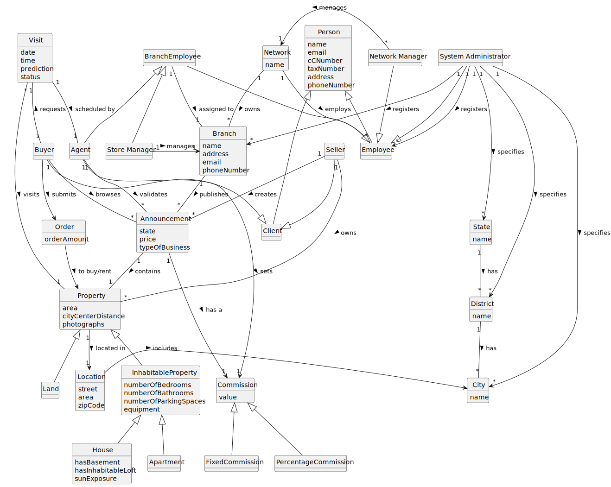

# Analysis

The construction process of the domain model is based on the client specifications, especially the nouns (for _concepts_) and verbs (for _relations_) used. 

## Rationale to identify domain conceptual classes ##
To identify domain conceptual classes, start by making a list of candidate conceptual classes inspired by the list of categories suggested in the book "Applying UML and Patterns: An Introduction to Object-Oriented Analysis and Design and Iterative Development". 

### _Conceptual Class Category List_ ###

**Business Transactions**

* Sale
* Rent

---

**Transaction Line Items**

* Price
* Commission

---

**Product/Service related to a Transaction or Transaction Line Item**

*  

---

**Transaction Records**

*  

---  

**Roles of People or Organizations**

* Branch
* System Administrator
* Network Manager
* Store Manager
* Agent
* Owner
* Client
* Buyer
* Seller
* User

---

**Places**

* State
* District
* City

---

**Noteworthy Events**

* Visit

---

**Physical Objects**

* Property
* House
* Apartment
* Land

---

**Descriptions of Things**

* Equipment
* Sun exposure

---

**Catalogs**

* Listing
* Announcement
* Order
* Schedule

---

**Containers**

*  

---

**Elements of Containers**

*  

---

**Organizations**

*  Real Estate USA

---

**Other External/Collaborating Systems**

*  

---

**Records of finance, work, contracts, legal matters**

* 

---

**Financial Instruments**

*  

---

**Documents mentioned/used to perform some work/**

* Photographs
---

###**Rationale to identify associations between conceptual classes**###

An association is a relationship between instances of objects that indicates a relevant connection and that is worth of remembering, or it is derivable from the List of Common Associations: 

+ **_A_** is physically or logically part of **_B_**
+ **_A_** is physically or logically contained in/on **_B_**
+ **_A_** is a description for **_B_**
+ **_A_** known/logged/recorded/reported/captured in **_B_**
+ **_A_** uses or manages or owns **_B_**
+ **_A_** is related with a transaction (item) of **_B_**
+ etc.

| Concept (A) 		                                               |  Association   	   |                 Concept (B) |
|--------------------------------------------------------------|:------------------:|----------------------------:|
| Announcement  	                                              |  contains    		 	  |                    Property |
| Branch	                                                      | publishes     		 	 |                Announcement |
| 	      Seller                                                |    creates		 	     |                Announcement |
| 	         Seller                                             |     	is a 	 	      |                      Client |
| 	          Seller                                            |      	owns	 	      |                    Property |
| 	           House                                            |      		 ia a	      |                    Property |
| 	           Appartment                                       |      		 ia a	      |                    Property |
| 	           Land                                             |      		 ia a	      |                    Property |
| 	            Property                                        |   		 	located in   |                        City |
| 	     City                                                   |    located in		    |                    District |
| District	                                                    |    located in		    |                       State |
| 	          System Administrator                              |  specifies    		   | City District State |
| System Administrator Network Manager Branch manager	 |  is a          		  |                    Employee |
| 	                      Employee                              |   works at    		   |                      Branch |
| 	                              Buyer                         |     requests		     |                       Visit |
| 	                       Visit                                |   scheduled by		   |                       Agent |
| 	                                 Agent                      |    validates		     |                Announcement |
| 	                Network                                     |     employs		      |                   Employees |
| 	                  Buyer                                     |     browses		      |                             |
| 	                 Network                                    |       owns		       |                      Branch |
| 	                   System Administrator                     |  registers     		  |                      Branch |

## Domain Model

**Do NOT forget to identify concepts atributes too.**

**Insert below the Domain Model Diagram in a SVG format**

